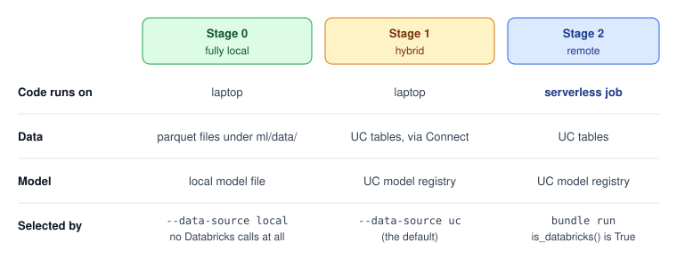

**Prerequisite**: Python and pandas, the basics of the Spark DataFrame API, Git and a terminal, a passing familiarity with MLflow and Databricks notebooks.

**Code**: <a href="https://github.com/hovinh/databricks-learning-lab">Github</a>

- [Notebooks Are Great Until the Code Has to Ship](#notebooks-are-great-until-the-code-has-to-ship)
- [Getting the Versions to Agree First](#getting-the-versions-to-agree-first)
- [One Login for the CLI, Connect and MLflow](#one-login-for-the-cli-connect-and-mlflow)
- [A Lockfile That Means the Same Thing Everywhere](#a-lockfile-that-means-the-same-thing-everywhere)
- [Keep Databricks at the Edges](#keep-databricks-at-the-edges)
- [Three Stages, One Codebase](#three-stages-one-codebase)
- [Helpers That Remove Whole Classes of Bugs](#helpers-that-remove-whole-classes-of-bugs)
- [Tests That Never Touch Databricks](#tests-that-never-touch-databricks)
- [Tracking and Promoting the Model in Unity Catalog](#tracking-and-promoting-the-model-in-unity-catalog)
- [Cheat Sheet](#cheat-sheet)
- [Summary](#summary)

## Notebooks Are Great Until the Code Has to Ship

Databricks notebooks are a lovely place to explore data: the cluster is already there, the tables are one `spark.table(...)` away, and a chart is one click from a DataFrame. They become painful the moment the code has to be **tested, reviewed, versioned and scheduled**. A diff of a notebook is noise, a unit test against a notebook is awkward, and "it worked when I ran the cells in this order" is not a deployment strategy. Purely local code has the opposite problem: it's easy to test and review, but it can't see your Unity Catalog (UC) data and it can't run on a schedule.

This series comes out of a production ML project at work: batch predictions every two hours, a weekly retrain, and four environments from dev to prod. Over its lifetime I ended up with a setup that I now wish I'd had on day one, and almost every trick in it was paid for with a real error message. The idea fits in one sentence:

> Write normal Python in your IDE, run it locally against real Unity Catalog data through **Databricks Connect**, then deploy the exact same files as serverless jobs with **Databricks Asset Bundles**.

I can't show the work project, so I rebuilt the setup as a small but complete demo on **Databricks Free Edition**, which anyone can sign up for. It predicts NYC taxi fares from the built-in `samples.nyctaxi.trips` table, and it has everything a real project has, just smaller:

- three pipelines: feature engineering, training and prediction
- its **own UC schema and tables**, created by a SQL release runner rather than by hand
- a LightGBM model in the UC model registry, promoted with a `champion` alias
- three jobs: a daily predict, a weekly retrain and a manual SQL release
- two environments, `dev` and `prd`, on one workspace

Everything shown ran end to end on Free Edition in October 2026, with Databricks CLI v1.20.0, `databricks-connect` 17.3.12 and serverless environment version 4. Every output in the series is a real capture, and the complete code is in the repository linked above.

{:data-width="760" data-height="360"}
Fig. 1. The three paths from the laptop into the workspace. Databricks Connect sends Spark work to serverless compute, MLflow talks to the tracking server and the UC registry over REST, and `bundle deploy` uploads the same code as workspace files plus job definitions, which then run on the same serverless compute.
{:.figure}

The series has two parts. **This part** is everything that runs from your laptop: getting the tools to agree, the one structural idea that makes the rest possible (keeping Databricks at the edges of the code), running in three stages from fully offline to real UC data, small helpers, offline tests, and tracking and registering the model. By the end, the whole pipeline runs from your IDE. **Part 2** ships it: jobs as code, owning your tables with a resumable SQL release runner, the gotchas that only appear after deploy, and what changes when one workspace becomes four environments.

## Getting the Versions to Agree First

Most of the hours I lost on the work project weren't spent on model code. They went on version mismatches between things that have to agree: my Python and the cluster's Python, my CLI and the bundle schema, the job's environment and the libraries it installs. So before writing a line of code, get every tool installed at the *right* version.

### A Databricks workspace

Sign up for **Databricks Free Edition**. You get one workspace with Unity Catalog, serverless compute only, a default `workspace` catalog, and the read-only `samples` catalog. The demo puts everything in the schema `workspace.taxi_dev`, plus `workspace.taxi_prd` for the "production" target: one schema per environment is how we simulate several environments on a single workspace.

The Free Edition limits that matter here<sup><a href="https://docs.databricks.com/aws/en/getting-started/free-edition-limitations">(1)</a></sup>:

- serverless compute only, and at most **5 concurrent job tasks** per account (the demo's jobs need one or two)
- a compute quota: exceed it and compute shuts down for the rest of the day, "and in extreme cases, the rest of the month"
- outbound internet restricted to trusted domains (PyPI is one, so jobs can install their dependencies)
- one 2X-Small SQL warehouse
- catalog creation isn't documented, so the demo only creates schemas inside `workspace`

In an enterprise setup the picture is different: you usually get a workspace per environment, catalogs that already exist, and you have to ask for grants (`USE CATALOG`, `USE SCHEMA`, `CREATE TABLE`, `CREATE MODEL`) before anything works.

### The Databricks CLI

Install it with `winget install Databricks.DatabricksCLI` on Windows, `brew install databricks/tap/databricks` on macOS, or a release binary from GitHub, and check it with `databricks --version`.

**Keep it current.** On the work project, an old CLI one day refused to deploy with:

```text
Error: error downloading Terraform: unable to verify checksums signature: openpgp: key expired
```

That looks like a broken config, but it's the signing key embedded in the old CLI that expired. `winget upgrade --id Databricks.DatabricksCLI` fixes it. The demo was built on v1.20.0, which deploys without downloading Terraform at all, so only old CLIs hit this.

### Python, matched to the runtime

Databricks Connect serialises code and data between your laptop and the remote compute, so the two Pythons have to agree:

> Your local Python minor version must equal the Python version of the Databricks runtime you connect to.

| Thing | Version | Why |
|---|---|---|
| `databricks-connect` | 17.3.x | targets Databricks Runtime 17.3 |
| Databricks Runtime 17.3 | Python 3.12 | the runtime's interpreter |
| local venv | Python 3.12 | must match the line above |
| serverless job `environment_version` | `"4"` | env 4 pairs with Databricks Connect 17.3 and Python 3.12.3 (Part 2) |

On Windows, use the `py` launcher (`py -0p` lists installed versions, `py -3.12 -m venv ...` picks one) rather than trusting whichever `python` comes first on `PATH`.

What does Free Edition actually run? A Connect session to serverless compute reports Python 3.12.3, and `SELECT version()` says Spark 4.2.0. Serverless environment versions 3 to 6 all run Python 3.12.3, and each pairs with one Connect version (4 with 17.3, 5 with 18, 6 with 19). The demo pins `databricks-connect==17.3.12` and runs its jobs on `environment_version: "4"`, so laptop and job match exactly.

An honest footnote: the demo first ran its jobs on environment 5 (Connect 18), and everything worked, because what job dependencies really care about is the Python version. I switched to 4 anyway. One matching pair is one less thing to wonder about when something breaks.

### What Databricks Connect actually is

**Databricks Connect** is a thin client. Your local Python builds Spark DataFrame *plans* and sends them over gRPC (Spark Connect) to remote compute. The Spark work runs remotely; `.toPandas()` brings the result back, and everything after that point, pandas and LightGBM included, runs on your laptop. A few consequences follow:

- Filtering, joining and aggregating in Spark *before* `.toPandas()` is cheap. Pulling whole tables to the laptop is slow.
- A local training run uses your laptop's CPU and RAM, not the cluster's.
- **Don't install `pyspark` next to `databricks-connect`.** Connect ships its own `pyspark` package, and the two conflict.
- On serverless there's no cluster ID to manage: `DatabricksSession.builder.serverless().profile("DEFAULT").getOrCreate()` is the whole connection.

A ten-line smoke test proves the setup before anything else. `connect` is the project's Spark module, which we'll meet properly later:

```python
import connect
import settings


def main():
    spark = connect.get_spark()
    spark.range(3).show()
    print(connect.to_pandas(spark.table(settings.SOURCE_TABLE), limit=5))


if __name__ == "__main__":
    main()
```

```text
+---+
| id|
+---+
|  0|
|  1|
|  2|
+---+

  tpep_pickup_datetime tpep_dropoff_datetime  ...  pickup_zip  dropoff_zip
0  2016-02-13 21:47:53   2016-02-13 21:57:15  ...       10103        10110
1  2016-02-13 18:29:09   2016-02-13 18:37:23  ...       10023        10023
2  2016-02-06 19:40:58   2016-02-06 19:52:32  ...       10001        10018
3  2016-02-12 19:06:43   2016-02-12 19:20:54  ...       10044        10111
4  2016-02-23 10:27:56   2016-02-23 10:58:33  ...       10199        10022

[5 rows x 6 columns]
```

### Windows and corporate networks

I develop on Windows behind a corporate network, and each of these cost me an afternoon:

- **Pick one shell** (cmd.exe or Git Bash) and stick with it. PowerShell's activation and quoting rules differ, and copy-pasted commands break in subtle ways.
- **Don't create the venv in a deep or OneDrive-synced path.** Some packages ship files nested deeply enough to exceed Windows' 260-character `MAX_PATH`, and `pip install` dies halfway. Put venvs somewhere short, like `%USERPROFILE%\.venvs\<project>`.
- Behind a corporate proxy, pip may need `--trusted-host pypi.org --trusted-host pypi.python.org --trusted-host files.pythonhosted.org`.
- A TLS-inspection proxy can break Python's HTTPS with `SSLCertVerificationError: self-signed certificate in certificate chain` even when your browser works fine. `pip install pip-system-certs` makes Python trust the operating system's certificate store.
- **MLflow prints emoji, and Windows pipes can't encode them.** MLflow 3 prints `🏃 View run ...` when a run ends. When stdout is a pipe (a task runner, CI, `| tee`), Windows Python encodes it as cp1252, and the pipeline dies with `UnicodeEncodeError: 'charmap' codec can't encode character '\U0001f3c3'`, *after* training succeeded. The demo's logger setup reconfigures stdout with `errors="backslashreplace"`. Setting `PYTHONUTF8=1` also works.

## One Login for the CLI, Connect and MLflow

Three tools need credentials: the CLI, Databricks Connect and MLflow. You want one login for all three, and you want no host or token anywhere in the code.

```bash
databricks auth login --host https://<workspace-host> --profile DEFAULT
databricks current-user me --profile DEFAULT     # check
```

This is OAuth: browser-based and short-lived, which beats a personal access token sitting in a file. It writes a **profile** to `~/.databrickscfg`, and code refers only to the profile's *name*. In the demo that name lives in exactly one place, a setting that honours the same environment variable the Databricks SDK itself reads:

```python
DATABRICKS_PROFILE = os.environ.get("DATABRICKS_CONFIG_PROFILE", "DEFAULT")
```

Two traps live here.

**Pass the bare workspace root as `--host`, not a URL copied from the browser.** I once logged in with something like `https://<host>/editor/files/<id>`. Databricks Connect kept working, because it only uses the scheme and host for gRPC. MLflow broke: its REST client appends `/api/2.0/...` to the full string, the workspace answers with its HTML login page, and you get `MlflowException: ... response body was not in a valid JSON format`. It looks like a permissions problem, but it isn't. Check the `host =` line in `~/.databrickscfg` and log in again with the bare host.

**The Python SDK needs the CLI on its `PATH`.** `auth login` writes `auth_type = databricks-cli` into the profile, so Databricks Connect and MLflow get their token by running `databricks auth token` behind the scenes. If the `databricks` executable isn't on the `PATH` of the *Python process* (say, a terminal or IDE opened before you installed the CLI), Connect fails with `ValueError: default auth: cannot configure default credentials ... auth_type=databricks-cli`. Restarting the terminal or IDE fixes it.

## A Lockfile That Means the Same Thing Everywhere

"Works on my machine" is only useful if my machine and the job have the same libraries. The demo uses **pip-tools** with two files:

- `requirements.in`: the direct dependencies only, each **pinned with `==`**, covering both runtime and dev tooling.
- `requirements.txt`: the fully resolved lock, generated by `pip-compile`. Never edited by hand.

The runtime half of `requirements.in` (the rest is dev tooling: pytest, flake8, black, isort, invoke and ipykernel, all pinned the same way):

```text
# Python 3.12 (databricks-connect 17.3.x <-> Databricks Runtime 17.3 <-> Python 3.12).
# Keep pandas/lightgbm/mlflow in sync with the `ml_dependencies` variable in databricks.yml.

databricks-connect==17.3.12
pandas==2.3.3
numpy==2.5.1
lightgbm==4.7.0
mlflow==3.15.1
pyyaml==6.0.3
```

The venv lives *outside* the project, at the short path from the Windows notes above:

```bash
py -3.12 -m venv %USERPROFILE%\.venvs\taxi
%USERPROFILE%\.venvs\taxi\Scripts\activate
python -m pip install --upgrade pip pip-tools
python -m piptools compile requirements.in -o requirements.txt   # after editing the .in
python -m piptools sync requirements.txt                          # venv == txt, exactly
```

Three rules keep it honest. Never `pip install` straight into the venv: the next `sync` removes it. List only what your code imports. To upgrade, bump the `.in`, recompile, review the `.txt` diff, then sync.

There's one piece of duplication I couldn't remove, and I'd rather name it than hide it:

> The same pins appear in three places: `requirements.in`, the bundle's job environment (which installs the serverless job's libraries), and the model's MLflow `pip_requirements`.

The demo writes the job's list once for all jobs (a bundle variable, shown in Part 2) and derives the MLflow list from the *installed* versions (shown below), so only the first two can drift, and a comment in each points at the other. If you prefer `uv` or `pyproject.toml`, use them: the principle is pinned direct dependencies plus a compiled lock, not the tool.

## Keep Databricks at the Edges

Here is the idea the rest of the series builds on. In the first version of the work project, Spark calls were wherever they were convenient: a `spark.table(...)` in the feature code, an `mlflow.log_metric` in the training loop, a logging setup at import time. Nothing could be tested without a cluster, every module was "Databricks code", and a change to how we read data touched half the files. The fix was a layering rule:

> Only two files may talk to Databricks. Everything else is plain Python that takes and returns pandas DataFrames.

- **Boundary modules.** `connect.py` is the *only* file that talks to Spark or UC. `mlflow_utils.py` is the *only* file that calls `mlflow.*`.
- **Pure logic.** `features/` and `model/` take and return pandas DataFrames. They do no I/O, no logging setup and no environment checks.
- **Entry points.** `pipelines/<name>.py` wire the boundaries and the logic together. They are the only files that call `setup_logger()`, and only under `if __name__ == "__main__":`, so importing a pipeline function has no side effects.
- **An explicit environment object.** Every boundary function receives an `env` saying which catalog, schema and data source to use, instead of reading globals.

{:data-width="760" data-height="400"}
Fig. 2. The layering rule. Pipelines call pure logic and the two boundary modules; only the boundaries reach Databricks. Tests replace the boundaries with mocks (red line), so everything above it runs offline. `settings.Env` travels with every boundary call to say where to read and write.
{:.figure}

The project layout follows the rule. At the top level there are three concerns: how it's deployed (`databricks.yml` and `resources/`), the tables (`sql/`) and the code (`ml/`). Inside `ml/`, files are grouped by role:

```text
databricks-learning-lab/
├── databricks.yml                      # DEPLOY: bundle root, variables, targets
├── resources/                          #   one YAML per job
│   ├── job_predict.yml                 #     feature_engineering -> predict, daily
│   ├── job_retrain.yml                 #     train, weekly
│   └── job_sql_release.yml             #     SQL release runner, manual
├── sql/                                # TABLES: released by the runner, not the bundle
│   ├── schemas/taxi.sql
│   ├── tables/taxi_features.sql
│   ├── tables/taxi_predictions.sql
│   ├── views/vw_latest_predictions.sql
│   ├── releases/20261006_sql_release_init.yaml
│   └── runner/run_sql_release.py       #   DDL tooling, so it lives with the SQL
├── .gitignore
└── ml/                                 # CODE: all ML Python; run commands from here
    │  boundaries: the only files that touch Databricks
    ├── connect.py                      #   Spark/UC (+ local parquet mode)
    ├── mlflow_utils.py                 #   MLflow tracking + UC registry
    │  pure logic: pandas in, pandas out
    ├── features/   __init__.py, batch.py, build.py
    ├── model/      __init__.py, train.py, io.py
    │  entry points: what the jobs run
    ├── pipelines/  __init__.py, feature_engineering.py, train.py, predict.py
    │  shared plumbing
    ├── settings.py                     #   names, features, Env, CLI args
    ├── runtime.py                      #   is_databricks(), task values, widgets
    ├── utils/      __init__.py, log.py
    │  developer tooling
    ├── scripts/    __init__.py, smoke_test_connect.py, export_source.py
    ├── tests/      __init__.py, conftest.py, test_*.py
    ├── tasks.py                        #   invoke tasks: format, lint, test, run
    ├── requirements.in, requirements.txt
    ├── .flake8, .isort.cfg, pytest.ini
    └── data/, logs/                    #   created at runtime, gitignored
```

It's about 1,750 lines of Python in total, and no file is longer than the SQL runner's 325. Some folders hold a single file (`utils/`, `sql/views/`); that's deliberate, because they show where the next file goes as the project grows. If you only want the gist, five files carry it: [`connect.py`](https://github.com/hovinh/databricks-learning-lab/blob/main/ml/connect.py), [`mlflow_utils.py`](https://github.com/hovinh/databricks-learning-lab/blob/main/ml/mlflow_utils.py), [`pipelines/predict.py`](https://github.com/hovinh/databricks-learning-lab/blob/main/ml/pipelines/predict.py), [`databricks.yml`](https://github.com/hovinh/databricks-learning-lab/blob/main/databricks.yml) and [`resources/job_predict.yml`](https://github.com/hovinh/databricks-learning-lab/blob/main/resources/job_predict.yml).

The environment object is a small frozen dataclass. Pipelines build it from command-line arguments, which is what jobs pass, falling back to environment variables, which are handy locally, and then to dev defaults:

```python
import argparse
import os
from dataclasses import dataclass

MODEL_BASENAME = "taxi_fare_model"


@dataclass(frozen=True)
class Env:
    """Where a run reads and writes. Passed explicitly to every connect.* and
    mlflow_utils.* call instead of living in import-time globals."""

    catalog: str
    schema: str
    data_source: str = "uc"  # "uc" or "local"

    def table(self, name: str) -> str:
        return f"{self.catalog}.{self.schema}.{name}"

    @property
    def model_name(self) -> str:
        return self.table(MODEL_BASENAME)

    @property
    def experiment_path(self) -> str:
        # One experiment per environment so dev and prd runs never mix.
        return f"/Shared/nyc_taxi_{self.schema}"


def base_arg_parser() -> argparse.ArgumentParser:
    """Arguments every pipeline accepts. Resolution order: CLI argument (what
    jobs pass) -> env var (handy locally) -> default (dev)."""
    parser = argparse.ArgumentParser()
    parser.add_argument(
        "--catalog", default=os.environ.get("TAXI_CATALOG", "workspace")
    )
    parser.add_argument("--schema", default=os.environ.get("TAXI_SCHEMA", "taxi_dev"))
    parser.add_argument(
        "--data-source",
        choices=["uc", "local"],
        default=os.environ.get("TAXI_DATA_SOURCE", "uc"),
    )
    return parser


def env_from_args(args: argparse.Namespace) -> Env:
    return Env(catalog=args.catalog, schema=args.schema, data_source=args.data_source)
```

And here is an entry point, the predict pipeline, to show what "wiring" means. It reads features through `connect`, scores them with the champion model through `mlflow_utils`, and writes through `connect` again, and there isn't a single Spark or MLflow call in it. (The [full file](https://github.com/hovinh/databricks-learning-lab/blob/main/ml/pipelines/predict.py) starts with a few lines of `sys.path` bootstrap that serverless jobs need; Part 2 explains why.)

```python
# Carried alongside the features and reattached after predicting: MLflow's
# signature enforcement drops every column the signature doesn't declare.
ID_COLUMNS = ["trip_id", "batch_id", "pickup_ts"]


def predict(env, batch_id: Optional[int] = None) -> int:
    """Scores one feature batch (default: the latest) and writes predictions.
    Returns the number of rows written."""
    source = "given"
    if batch_id is None:
        batch_id = connect.read_latest_batch_id(env, settings.FEATURES_TABLE)
        source = "latest in table"
    if batch_id is None:
        raise ValueError(f"{settings.FEATURES_TABLE} is empty: nothing to score.")
    logger.info("Scoring batch_id=%d (%s)", batch_id, source)

    df, _ = connect.read_features(env, batch_id, batch_id)
    if df.empty:
        raise ValueError(f"No feature rows for batch_id={batch_id}.")
    missing = [c for c in settings.FEATURES + ID_COLUMNS if c not in df.columns]
    if missing:
        raise ValueError(f"Feature rows are missing columns: {missing}")

    X = prepare_X(df)
    if env.data_source == "local":
        predictions = load_booster(settings.LOCAL_MODEL_PATH).predict(X)
        version = "local"
    else:
        model, version = mlflow_utils.load_champion(env)
        predictions = model.predict(X)

    out = df[ID_COLUMNS].copy()
    out["predicted_fare"] = np.asarray(predictions, dtype="float64")
    out["model_version"] = version
    out["created_at"] = utc_now()
    connect.write_batch(
        env, out[settings.PREDICTION_TABLE_COLUMNS], settings.PREDICTIONS_TABLE
    )
    logger.info("Wrote %d predictions for batch_id=%d", len(out), batch_id)
    return len(out)


if __name__ == "__main__":
    parser = settings.base_arg_parser()
    parser.add_argument("--batch-id", type=settings.optional_int)
    args, _ = parser.parse_known_args()

    setup_logger(process_name="predict")
    predict(settings.env_from_args(args), args.batch_id)
```

The payoffs show up in every later section. The tests mock two modules and run fully offline. Swapping where the data comes from touches one file. And a notebook can import `predict` and call it without its logging being hijacked.

### Naming traps the layout avoids on purpose

A few names in that tree are the way they are because the alternatives broke something:

- **Folder names starting with a digit**, like `02_ml_modeling/`, aren't valid Python identifiers, so `import 02_ml_modeling...` is a `SyntaxError`. You end up with `importlib.import_module(...)` or `sys.path` tricks. Plain names avoid all of it.
- **A package and a script with the same name**, like `data_prep/` and `pipelines/data_prep.py`. Without `data_prep/__init__.py`, the folder is only an implicit namespace package. On Databricks, the job puts `pipelines/` on `sys.path`, so the *script* wins and the import fails with `'data_prep' is not a package`. It never reproduces locally. Always add `__init__.py`, and avoid the clash: hence `features/` next to `pipelines/feature_engineering.py`.
- **A module named like a standard-library module**, such as `utils/logging.py`, works but invites confusion; the demo uses `utils/log.py`.
- **Run pipelines as modules from `ml/`**: `python -m pipelines.train`, not `python pipelines/train.py`. The file form puts `pipelines/` on `sys.path` instead of `ml/`, so imports like `import settings` fail with `ModuleNotFoundError`. (The demo's pipelines survive it anyway, thanks to the bootstrap Part 2 explains, but `-m` is the habit to build.)

## Three Stages, One Codebase

With Databricks confined to two files, a question becomes cheap to answer that is otherwise expensive: *where should this run right now?*

There are good reasons to start locally. The most common one in real projects is that **the data isn't in Databricks yet**: the ingestion pipeline isn't built, or the source team hasn't landed the tables, but someone has sent you an extract as CSV or parquet. Local runs also give you breakpoints and instant reruns with no job start-up, no compute cost for pure pandas work, and **reproducible experiments on a frozen snapshot**, so you compare model changes against identical data rather than a table that moves under you. And you can work on a train.

There are equally good reasons to go to Databricks: data too big for a laptop, Spark-heavy joins that belong on the cluster, and things only a job can prove, like the job identity's permissions and the behaviour of the serverless environment. **Governance** can also decide for you: if the data is personal or confidential and must not leave the platform, local snapshots are simply not allowed.

So the demo supports three stages without a single code edit between them:

{:data-width="760" data-height="300"}
Fig. 3. The three stages. Stage 0 runs entirely on the laptop with local files. Stage 1 runs the code locally against real UC tables and the UC model registry through Databricks Connect. Stage 2 runs the same files as a serverless job (Part 2). Two independent switches select the stage.
{:.figure}

**Switch 1: where does the code run?** Databricks sets `DATABRICKS_RUNTIME_VERSION` inside every runtime and it's unset on a laptop. One helper gives that check a name:

```python
import os


def is_databricks() -> bool:
    """True inside any Databricks runtime (job task, notebook), False locally."""
    return "DATABRICKS_RUNTIME_VERSION" in os.environ
```

It decides four things: the Spark session (below), the MLflow URIs, whether logs also go to a file, and whether local debug snapshots are written. The Spark session is the clearest example. It's created on first use, never at import time, which matters for testing:

```python
_spark = None


def get_spark():
    """Creates the Spark session on first use, never at import time, so tests
    can import this module offline."""
    global _spark
    if _spark is None:
        if runtime.is_databricks():
            from pyspark.sql import SparkSession

            _spark = SparkSession.builder.getOrCreate()
        else:
            from databricks.connect import DatabricksSession

            _spark = (
                DatabricksSession.builder.serverless()
                .profile(settings.DATABRICKS_PROFILE)
                .getOrCreate()
            )
        # Same time zone locally and in jobs, so dates don't shift.
        _spark.conf.set("spark.sql.session.timeZone", "UTC")
    return _spark
```

**Switch 2: where do the data and the model live?** That's `--data-source local|uc` (or the `TAXI_DATA_SOURCE` environment variable), carried on `env.data_source`. With `local`, every `connect.read_*` reads parquet files under `ml/data/`, `connect.write_batch` writes parquet there, and the model is saved to and loaded from a local file. **No Databricks is needed at all.** With `uc`, the same functions use real tables and the UC model registry. Because only `connect.py` and the pipelines' model-loading branch know about this switch, the feature and model code never notice.

What bridges Stage 1 to Stage 0 is a small decorator. Every `connect.read_*` function wears it, and when the code runs locally against UC, the result is also written to `ml/data/01_raw/<function>.csv` and `.parquet` (by a three-line `_write_snapshot` helper):

```python
def export_snapshot(name=None, selector=None):
    """Also dumps the decorated read's result to ml/data/01_raw/<name>.csv and
    .parquet when running locally against UC. The decorated function must take
    `env` as its first argument; `selector` picks the DataFrame out of a tuple
    result."""

    def decorator(func):
        @functools.wraps(func)
        def wrapper(env, *args, **kwargs):
            result = func(env, *args, **kwargs)
            if not runtime.is_databricks() and env.data_source == "uc":
                df = selector(result) if selector else result
                _write_snapshot(df, name or func.__name__)
            return result

        return wrapper

    return decorator
```

You get a frozen copy of exactly what the pipeline saw, to open in Excel when a number looks wrong or to replay offline later.

In the demo the data *is* already in Databricks, so to tell the Stage 0 story we fake "we only have an extract". A one-off script copies the source table to `ml/data/01_raw/source_trips.parquet`, and from then on nothing touches Databricks:

```bash
# from ml/
python -m scripts.export_source                      # one-off: source table -> local parquet
invoke backfill --start 2016-01-08 --end 2016-02-15 --data-source local
invoke run-local --data-source local                 # features -> train -> predict, zero Databricks calls
```

In a real project, that parquet file would be the extract someone emailed you. Stage 1 is the same commands without `--data-source local`. It needs the project's tables to exist first, and one command creates them from your laptop:

```bash
invoke sql-release --release releases/20261006_sql_release_init.yaml
```

That's the SQL release runner, and it gets a whole section in Part 2: tables hold state, so they can't be deployed the way code is.

A word on the data. `samples.nyctaxi.trips` holds 21,932 trips over 60 days, from 2016-01-01 00:04 to 2016-02-29 23:51 UTC. The first feature batch needs seven days of history, hence a backfill starting on 2016-01-08; ending it on 2016-02-15 leaves 14 days for the scheduled job to "discover" one day at a time. One day stands out: 2016-01-23 has only 78 trips against roughly 350 on a normal day. That's the January 2016 blizzard, visible in a sample table.

The two stages give **identical results**. Here is the training step's log both ways:

```text
# Stage 1: invoke run-local  (data: UC via Connect, model: UC registry)
[INFO 2026-10-08 20:56:26 log:42] Logging initialised for train
[INFO 2026-10-08 20:56:37 connect:72] Snapshot of read_features written to ...\ml\data\01_raw
[INFO 2026-10-08 20:56:38 train:56] Metrics: {'mae': 1.5793594128390827, 'rmse': 4.819345128558056, 'baseline_mae': 4.452145178764897, 'n_train': 7174.0, 'n_test': 2769.0}
[INFO 2026-10-08 20:59:25 mlflow_utils:67] Registered workspace.taxi_dev.taxi_fare_model v1 as @champion

# Stage 0: invoke run-local --data-source local  (data + model: local files)
[INFO 2026-10-08 21:02:00 log:42] Logging initialised for train
[INFO 2026-10-08 21:02:00 train:56] Metrics: {'mae': 1.5793594128390827, 'rmse': 4.819345128558058, 'baseline_mae': 4.452145178764897, 'n_train': 7174.0, 'n_test': 2769.0}
[INFO 2026-10-08 21:02:00 train:60] Saved local model to ...\ml\data\03_model\model.txt
```

The metrics match (`rmse` differs in the fifteenth digit, which is float noise). Reading from UC took about 11 seconds against an instant local read, and registering the model took about three minutes against writing a local file. And notice Stage 1's `Snapshot of read_features` line: that's how Stage 0's data is born.

## Helpers That Remove Whole Classes of Bugs

On the work project, the helpers in this section grew one at a time, each after something broke. The demo has them from day one. First, the inner loop is a handful of `invoke` tasks run from `ml/`:

```bash
invoke all                                           # black + isort -> flake8 -> pytest
invoke run-local [--data-source local]               # feature_engineering -> train -> predict
invoke backfill --start 2016-01-08 --end 2016-02-15  # feature history for a date range
invoke sql-release --release releases/<file>.yaml [--dry-run]
```

`invoke all` is **the definition of done** for every change: if it's green, the change is finished. The helpers themselves:

| Helper | What it solves | Without it |
|---|---|---|
| `runtime.is_databricks()` | one named switch for "am I on Databricks?" | the same environment-variable check repeated in many files |
| `connect.to_pandas(spark_df)` | casts UC `DECIMAL` columns to float64 and clears Connect's `df.attrs` | crashes far from their cause |
| `connect.write_batch(env, df, table)` | idempotent batch writes, aligned to the target table's own schema | copy-pasted writers and hand-kept column lists |
| `settings.Env` + `base_arg_parser()` | one object says which catalog, schema and data source | import-time constants, monkeypatched one by one in tests |
| `model.train.prepare_X(df)` | selects the features and casts *all* of them to float64 | nullability and int-versus-float signature traps (see MLflow below) |
| `runtime.set_task_value()` | the feature task publishes the `batch_id` it built, and predict scores exactly that batch | two tasks each guessing "the latest batch", which can race |
| `runtime.get_widget()` | for notebook tasks: a widget or job parameter, with a default elsewhere | notebooks that only work inside a job |
| DDL contract test | asserts the column lists in code match the table DDL, in order | "change these three files together" as a warning in a README |
| failing loudly | empty input, missing columns, no champion model: `raise` with a hint | a pipeline that logs an error and *returns*, and a green job |

Three of them deserve a closer look. `to_pandas` exists because of two separate crashes. UC `DECIMAL` columns arrive from `toPandas()` as `object` dtype holding `decimal.Decimal` values, which LightGBM rejects. And Databricks Connect fills `df.attrs` with query-plan metrics, which make `to_parquet` fail. (The taxi table has no `DECIMAL` columns, but real tables do, so the cast stays.)

```python
def to_pandas(spark_df, limit: Optional[int] = None) -> pd.DataFrame:
    """spark_df.toPandas() plus the clean-up every caller would otherwise need:
    UC DECIMAL columns arrive as object dtype holding decimal.Decimal (LightGBM
    rejects them) -> float64; Databricks Connect fills df.attrs with query-plan
    metrics that to_parquet() can't serialise -> cleared."""
    if limit is not None:
        spark_df = spark_df.limit(limit)
    df = spark_df.toPandas()
    df.attrs = {}
    for col in df.columns:
        if df[col].dtype != object:
            continue
        non_null = df[col].dropna()
        if not non_null.empty and isinstance(non_null.iloc[0], decimal.Decimal):
            df[col] = df[col].astype("float64")
    return df
```

`write_batch` is the only way any pipeline writes. Every row carries a `batch_id`, and the function replaces exactly one batch using Delta's `replaceWhere`, so a retry or a manual rerun never duplicates rows. It also reads the target table's schema and selects, orders and casts the DataFrame's columns to match, so no caller hand-maintains column order or worries about pandas' int64 against a table's `INT`. The UC half:

```python
def write_batch(env, df: pd.DataFrame, table_name: str, batch_col: str = "batch_id"):
    """Writes exactly one batch, idempotently: that batch's rows are replaced and
    every other batch is untouched, so reruns never duplicate rows."""
    batch_ids = df[batch_col].unique()
    if len(batch_ids) != 1:
        raise ValueError(f"write_batch expects one {batch_col}, got {list(batch_ids)}")
    batch_id = int(batch_ids[0])

    from pyspark.sql import functions as F

    spark = get_spark()
    table = env.table(table_name)
    fields = spark.table(table).schema.fields
    missing = [f.name for f in fields if f.name not in df.columns]
    if missing:
        raise ValueError(f"DataFrame is missing columns of {table}: {missing}")

    spark_df = spark.createDataFrame(df[[f.name for f in fields]])
    spark_df = spark_df.select(
        *[F.col(f.name).cast(f.dataType).alias(f.name) for f in fields]
    )
    (
        spark_df.write.mode("overwrite")
        .option("replaceWhere", f"{batch_col} = {batch_id}")
        .saveAsTable(table)
    )
```

The [full function](https://github.com/hovinh/databricks-learning-lab/blob/main/ml/connect.py) also has a local branch, which keeps a parquet file per table and does the same replace-one-batch step in pandas: that's what makes Stage 0 behave like Stage 1. `replaceWhere` with `saveAsTable` works over Databricks Connect on serverless. If your setup rejects it, the fallback is `DELETE FROM t WHERE batch_id = X` followed by an append, which is what the work project used: it works, but it isn't atomic.

**Failing loudly** is less a helper than a habit, and it's the one I'd keep if I could keep only one. The most expensive bug I've seen in a scheduled pipeline was a function that logged "no data found" and returned. The job was green for days while writing nothing. Every pipeline in the demo raises instead, with a hint about what to do:

```python
if end_batch_id is None:
    raise ValueError(
        f"{settings.FEATURES_TABLE} is empty. Run the feature_engineering "
        "backfill first (`invoke backfill --start ... --end ...`)."
    )
```

One last gotcha, which took me a while to believe: **`collect()` and `toPandas()` disagree on time zones.** Even with the session time zone set to UTC, `toPandas()` returns UTC wall-clock times, but the `Row` objects from `collect()` come back converted to the *laptop's* time zone. On my UTC+8 laptop, the first pickup in the table showed as 08:04 instead of 00:04. Do date logic in SQL (`to_date(...)`) or after `toPandas()`, never on `collect()`ed timestamps.

## Tests That Never Touch Databricks

The layering rule pays off most visibly in the test suite. It never opens a Spark session, yet it covers the pipelines' Databricks code paths. Four things make that work.

**Spark is lazy.** `get_spark()` builds the session on first call, never at import, so importing `connect` in a test costs nothing.

**A safety net catches accidents.** An autouse fixture replaces `connect.get_spark` with a function that fails the test, so a test that accidentally reaches Spark fails at once with a clear message instead of hanging on a network call:

```python
@pytest.fixture(autouse=True)
def no_spark(monkeypatch):
    """Any test that reaches a real Spark session fails immediately."""

    def _fail():
        pytest.fail("Test tried to open a Spark session; mock the connect.* call")

    monkeypatch.setattr(connect, "get_spark", _fail)


@pytest.fixture
def uc_env():
    return settings.Env(catalog="test_cat", schema="test_sch", data_source="uc")
```

Two more autouse fixtures in the [full `conftest.py`](https://github.com/hovinh/databricks-learning-lab/blob/main/ml/tests/conftest.py) make every test run "off Databricks" and point every local path into pytest's `tmp_path`. One detail there cost me a confusing afternoon: a path computed from another constant at import time, like `LOCAL_MODEL_PATH = MODEL_DIR / "model.txt"`, doesn't follow a patched `MODEL_DIR`, so each one has to be patched explicitly.

**Mock at the boundary.** Because the pipelines only reach Databricks through `connect.*` and `mlflow_utils.*`, those are the only things to patch. Then assert on what the pipeline *would have written*, which is the second positional argument of the mocked `write_batch`:

```python
def _run(env, features, model):
    with patch("connect.read_features", return_value=(features, {})), patch(
        "mlflow_utils.load_champion", return_value=(model, "7")
    ), patch("connect.write_batch") as write:
        predict(env, batch_id=20160110)
    return write


def test_writes_prediction_table_columns(uc_env):
    model = MagicMock()
    model.predict.return_value = np.array([1.0, 2.0, 3.0])
    write = _run(uc_env, _features(), model)
    out = write.call_args[0][1]
    assert list(out.columns) == settings.PREDICTION_TABLE_COLUMNS
    assert out["predicted_fare"].tolist() == [1.0, 2.0, 3.0]
    assert out["model_version"].unique().tolist() == ["7"]


def test_missing_feature_fails_loudly(uc_env):
    with pytest.raises(ValueError, match="missing columns"):
        _run(uc_env, _features().drop(columns=["trip_distance"]), MagicMock())
```

(`_features()` builds a small DataFrame with every feature column plus the IDs.)

**Local mode is itself a test double.** An `Env(data_source="local")` pointed at `tmp_path` exercises `write_batch`'s idempotency for real, with no mocks at all: write a batch twice and assert the row count didn't double. And when a test needs a job-only branch, `monkeypatch.setenv("DATABRICKS_RUNTIME_VERSION", "17.3")` makes `is_databricks()` return `True`.

Finally, some tests are plain functions over files. My favourite is the **contract test**. The tables' columns are declared twice, once in the SQL DDL and once in Python (the list `write_batch` callers build against), and this test parses the DDL and asserts the two match, in order:

```python
SQL_TABLES = settings.ML_ROOT.parent / "sql" / "tables"
COLUMN_LINE = re.compile(
    r"^\s*,?\s*([a-z_][a-z0-9_]*)\s+"
    r"(BIGINT|INT|DOUBLE|STRING|TIMESTAMP|DATE|BOOLEAN)\b",
    re.IGNORECASE,
)


def ddl_columns(path):
    lines = path.read_text(encoding="utf-8").splitlines()
    return [m.group(1) for m in map(COLUMN_LINE.match, lines) if m]


@pytest.mark.parametrize(
    "filename, expected",
    [
        ("taxi_features.sql", settings.FEATURE_TABLE_COLUMNS),
        ("taxi_predictions.sql", settings.PREDICTION_TABLE_COLUMNS),
    ],
)
def test_code_columns_match_ddl(filename, expected):
    assert ddl_columns(SQL_TABLES / filename) == expected
```

A "remember to change these files together" note in a README is a hope. A failing test is a guarantee.

One workflow tip that served me well: before implementing a component, write down its test cases (for each function, the case and what it asserts) and review that list first. It's a cheap way to find out you misunderstood the requirement before you've written the code.

## Tracking and Promoting the Model in Unity Catalog

MLflow is the second boundary, and it has its own environment switch. Inside a job there's no `~/.databrickscfg`, so a URI naming a profile fails there; on a laptop, the bare `databricks` URI has no credentials. Hence the branch:

```python
def configure_mlflow(env) -> None:
    """Inside Databricks, the bare URIs use the job's own identity. Locally
    there's no such context, so the CLI profile must be named in the URI."""
    if runtime.is_databricks():
        mlflow.set_tracking_uri("databricks")
        mlflow.set_registry_uri("databricks-uc")
    else:
        profile = settings.DATABRICKS_PROFILE
        mlflow.set_tracking_uri(f"databricks://{profile}")
        mlflow.set_registry_uri(f"databricks-uc://{profile}")
    mlflow.set_experiment(env.experiment_path)
```

Every function in `mlflow_utils` calls `configure_mlflow` first, and that matters more than it looks. **MLflow 3's default tracking store is a local SQLite file.** Any `mlflow` call made *before* the tracking URI is set (an ad-hoc `MlflowClient()` in a notebook or a script) silently creates `./mlflow.db` and logs to *that*. Your runs then never appear in the workspace, and nothing tells you why. That's one more reason to keep every MLflow call behind one module.

On Free Edition, **registering from your laptop works**: Stage 1's `python -m pipelines.train` logs the run, registers a new version of `workspace.taxi_dev.taxi_fare_model` and moves the `@champion` alias to it, and `python -m pipelines.predict` then loads that champion locally. It's just slow: registration took about three minutes from my laptop, mostly the artifact upload, and loading took about 40 seconds. The same registration inside the retrain job (Part 2) took about 12 seconds.

The demo model, trained on 28 daily batches ending 2016-02-16 (7,174 training rows, 2,769 test rows), scores a mean absolute error of 1.579 dollars and an RMSE of 4.819. The baseline, "the median fare for this pickup and dropoff zip pair over the last week", scores an MAE of 4.452, so the model is roughly 2.8 times better. Here is the whole log-and-register step:

```python
def log_and_register(env, booster, X_test, params, metrics, provenance) -> str:
    """Logs a training run, registers the model in UC and points the champion
    alias at the new version (unconditional promotion). Returns the version."""
    configure_mlflow(env)
    with mlflow.start_run(run_name="taxi_fare_train"):
        mlflow.log_params(params)
        mlflow.log_params({f"data_{k}": v for k, v in provenance.items()})
        mlflow.log_params(
            {
                "catalog": env.catalog,
                "schema": env.schema,
                "best_iteration": booster.best_iteration,
            }
        )
        mlflow.log_metrics(metrics)

        # UC requires a signature. X_test is already all-float64 (prepare_X),
        # so the signature never hard-codes "non-nullable integer" columns.
        signature = infer_signature(X_test, booster.predict(X_test))
        model_info = mlflow.lightgbm.log_model(
            booster,
            name="model",
            signature=signature,
            input_example=X_test.head(5),
            # Only what inference needs, from the versions actually installed,
            # so the model never claims a dependency the predict job lacks.
            pip_requirements=[
                f"lightgbm=={lgb.__version__}",
                f"pandas=={pd.__version__}",
            ],
        )

    version = mlflow.register_model(model_info.model_uri, env.model_name).version
    MlflowClient().set_registered_model_alias(
        env.model_name, settings.CHAMPION_ALIAS, version
    )
    return str(version)
```

There are three traps hiding in that function, and they all involve the **model signature**, the schema of inputs and outputs MLflow stores with the model.

**Trap 1: UC requires a signature.** Registration fails without one. `infer_signature` builds it from a sample of inputs and the model's outputs on that sample.

**Trap 2: the signature silently drops undeclared columns.** At `.predict(df)`, MLflow rebuilds `df` from only the signature's columns, so any ID or metadata columns you hoped to pass through simply vanish. The pattern is the one in the predict pipeline above: predict on the features only, and reattach `trip_id`, `batch_id` and `pickup_ts` afterwards.

**Trap 3: types and nullability are inferred from the sample.** An integer column with no nulls in *this* sample becomes a non-nullable long in the signature, and the first real null fails enforcement in production. The demo sidesteps the whole class of problem by casting every feature to float64, in training, in the signature and at prediction, with one function:

```python
def prepare_X(df: pd.DataFrame) -> pd.DataFrame:
    """Features only, all float64: the same frame for training, the MLflow
    signature, and prediction. Ints with/without nulls can't diverge."""
    return df[settings.FEATURES].astype("float64")
```

Two more details in `log_and_register` are worth copying. **Pin `pip_requirements`** to just what inference needs. Otherwise MLflow captures the training environment's full `pip freeze` and warns about a mismatch whenever the slimmer predict environment loads the model. Building the list from the installed versions (`lgb.__version__`) means it always matches what was tested. And log **data provenance** as parameters: the table name, the batch range and the **Delta table version** at training time (from `DESCRIBE HISTORY t LIMIT 1`). The data isn't packaged with the model, but you can replay it exactly with `SELECT * FROM t VERSION AS OF <n>`.

Promotion uses an **alias**: register a version, then point `champion` at it. Loading has one subtlety: resolve the alias to a concrete version *first*, then load that version, so the version you record next to your predictions is the one you actually used:

```python
def load_champion(env):
    """Returns (pyfunc model, version). The alias is resolved to a concrete
    version first, so the version recorded with predictions is the one used."""
    configure_mlflow(env)
    try:
        version = (
            MlflowClient()
            .get_model_version_by_alias(env.model_name, settings.CHAMPION_ALIAS)
            .version
        )
    except MlflowException as exc:
        raise RuntimeError(
            f"No @{settings.CHAMPION_ALIAS} version of {env.model_name}. Run the "
            "retrain job (or `python -m pipelines.train`) first."
        ) from exc
    model = mlflow.pyfunc.load_model(f"models:/{env.model_name}/{version}")
    return model, str(version)
```

The `except` turns MLflow's opaque "alias not found" into an instruction, which is the fail-loudly habit again: running predict before the first retrain tells you to run the retrain.

<!-- TODO(screenshot): fig04-mlflow-run.png, see screenshots.md -->
{:data-width="1440" data-height="900"}
Fig. 4. A training run in the MLflow experiment. The parameters include the data provenance (`data_table`, `data_start_batch_id`, `data_end_batch_id`, `data_table_version`), and the metrics put the model's `mae` next to the zip-pair `baseline_mae`.
{:.figure}

<!-- TODO(screenshot): fig05-model-version-champion.png, see screenshots.md -->
{:data-width="1440" data-height="900"}
Fig. 5. The registered model in Unity Catalog. Each retrain adds a version, and the `champion` alias points at the one the predict pipeline loads.
{:.figure}

In the demo every retrain is promoted unconditionally. The obvious extension is champion/challenger: promote only if the new version beats the current champion on the same test window.

### When one model isn't one booster

The work project needed something the demo doesn't: *two* LightGBM boosters, plus the logic that picks between them, versioned and promoted as one unit. The tool for that is a custom `mlflow.pyfunc.PythonModel`. In sketch form:

```python
import lightgbm as lgb
import mlflow
import numpy as np
import pandas as pd


class TwoModelWrapper(mlflow.pyfunc.PythonModel):
    def load_context(self, context):
        self.a = lgb.Booster(model_file=context.artifacts["model_a"])
        self.b = lgb.Booster(model_file=context.artifacts["model_b"])

    def predict(self, context, model_input, params=None):
        use_a = model_input["some_feature"] < 9
        return pd.Series(
            np.where(use_a, self.a.predict(model_input), self.b.predict(model_input))
        )


# mlflow.pyfunc.log_model(name="model", python_model=TwoModelWrapper(),
#     artifacts={"model_a": path_a, "model_b": path_b},
#     signature=signature, pip_requirements=[...])
```

### When the laptop can't register

One enterprise caveat. Registering and loading a UC model moves artifacts **directly to and from cloud storage**, bypassing the tracking server. In a locked-down workspace the storage firewall may only allow Databricks' own network, and a laptop then fails with `AuthorizationFailure` despite perfectly correct grants. The work project therefore skips registration when not on Databricks (the run, parameters and metrics still log), uses a locally saved model for local prediction, and fails fast with a one-line explanation if someone tries to load the champion locally. On Free Edition none of this is needed.

## Cheat Sheet

### Daily commands

```bash
# from ml/, venv active
invoke all                                             # format -> lint -> test (definition of done)
invoke run-local [--data-source local]                 # features -> train -> predict
invoke backfill --start 2016-01-08 --end 2016-02-15    # feature history
invoke sql-release --release releases/<file>.yaml [--dry-run]
python -m pipelines.train                              # one pipeline
python -m scripts.smoke_test_connect                   # is Connect working?
pytest tests/test_features.py::test_name               # one test
```

### Error, meaning, fix

| Error you see | What it actually means | Fix |
|---|---|---|
| `openpgp: key expired` on `bundle deploy` | the old CLI's embedded Terraform signing key expired | upgrade the CLI |
| `MlflowException: ... not in a valid JSON format` | the profile's host has a browser path appended | `auth login` with the bare host |
| `cannot configure default credentials ... auth_type=databricks-cli` | the Python process can't find the `databricks` CLI on its `PATH` | restart the terminal or IDE after installing the CLI |
| `ModuleNotFoundError: No module named 'settings'` | wrong `sys.path` (ran a file, not a module) | `python -m pipelines.x` from `ml/` |
| `SSLCertVerificationError: self-signed certificate` | corporate TLS inspection | `pip-system-certs` |
| pip fails mid-install on Windows | a path longer than 260 characters | a venv at a short path |
| `UnicodeEncodeError: 'charmap' codec ...` after training (Windows) | MLflow prints emoji into a cp1252 pipe | reconfigure stdout, or `PYTHONUTF8=1` |
| LightGBM rejects `object` dtype | UC `DECIMAL` arrives as `decimal.Decimal` | `connect.to_pandas` |
| `to_parquet` fails on `PlanMetrics` | Connect's `df.attrs` aren't serialisable | `connect.to_pandas` clears them |
| timestamps off by your UTC offset | `collect()` converts to the laptop's time zone | date logic in SQL or after `toPandas()` |
| a `mlflow.db` file appears, runs missing in the UI | an MLflow call before `configure_mlflow()` used the local SQLite default | keep MLflow calls in one module |
| UC registration fails, mentions a signature | UC requires a model signature | `infer_signature` |
| predictions lost their ID columns | signature enforcement drops undeclared columns | reattach IDs in the pipeline |
| MLflow warns about a requirements mismatch on load | the model was logged with the full training freeze | explicit `pip_requirements` |
| `AuthorizationFailure` registering a model (enterprise) | the storage firewall blocks your laptop | register from a job |
| job green but nothing written | the pipeline logged an error and returned | raise instead |

## Summary

If I had to compress this part into one rule, it would be: **keep Databricks at the edges.** Spark lives in one file and MLflow in another, and everything else is plain pandas. Every other section is that rule paying off somewhere new.

- **Where the code runs** (laptop or job) became one switch, `is_databricks()`, read only by the boundary modules.
- **Where the data lives** (local files or Unity Catalog) became a second, independent switch on the environment object. The two together gave three stages from one codebase, with identical results in Stage 0 and Stage 1.
- **Which catalog and schema** became a value passed explicitly with every call, never a global, so tests build one in a line.
- **What a test needs to mock** shrank to two modules, so the whole suite runs offline, and a safety net makes sure it stays that way.

At this point the whole pipeline runs from the IDE: features, training, registration with `@champion`, and prediction. What it doesn't do yet is run without me. Part 2 deploys the same files as scheduled serverless jobs, gives the tables a release process of their own, and works through what breaks only after deploy, all the way to an enterprise setup with four environments and service principals.

---

(1) <a href="https://docs.databricks.com/aws/en/getting-started/free-edition-limitations">https://docs.databricks.com/aws/en/getting-started/free-edition-limitations</a>
