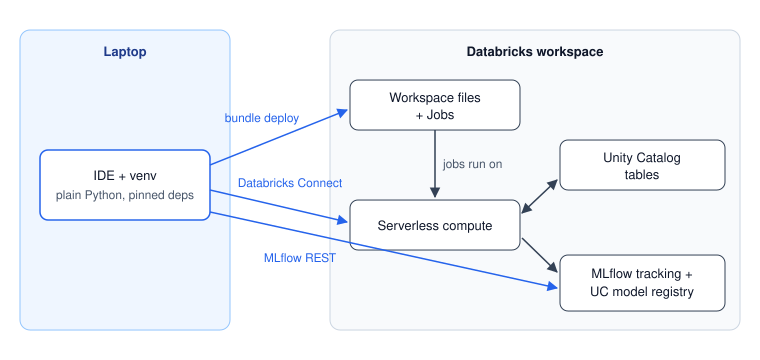

**Prerequisite**: [Part 1](../databricks-ml-setup-1-laptop/2026-10-09-databricks-ml-setup-1-laptop.md) of this series, YAML, basic SQL DDL (`CREATE TABLE`, `ALTER TABLE`).
<!-- TODO(migrate): point the Part 1 link at its published URL -->

**Code**: <a href="https://github.com/hovinh/databricks-learning-lab">Github</a>

- [Where Part 1 Left Off](#where-part-1-left-off)
- [Jobs as Code with Asset Bundles](#jobs-as-code-with-asset-bundles)
- [What Only Breaks After Deploy](#what-only-breaks-after-deploy)
- [Tables Are Not Code: A Resumable SQL Release Runner](#tables-are-not-code-a-resumable-sql-release-runner)
- [Batch Pipelines You Can Rerun Without Fear](#batch-pipelines-you-can-rerun-without-fear)
- [From One Workspace to Four Environments](#from-one-workspace-to-four-environments)
- [Cheat Sheet](#cheat-sheet)
- [Summary](#summary)

## Where Part 1 Left Off

Part 1 ended with an NYC taxi fare model whose whole pipeline (features, training, registration in the Unity Catalog model registry, prediction) runs from the IDE, either fully offline or against real Unity Catalog (UC) data through Databricks Connect. It worked because of one rule:

> Only two files may talk to Databricks. Everything else is plain Python that takes and returns pandas DataFrames.

Two switches came out of that rule. `runtime.is_databricks()` says *where the code runs*, and `env.data_source` says *where the data and model live*. Part 1 used Stage 0 (all local) and Stage 1 (laptop code, UC data). This part is **Stage 2**: the same files running as scheduled serverless jobs, with nobody at the keyboard.

{:data-width="760" data-height="360"}
Fig. 1. The three paths from the laptop into the workspace, repeated from Part 1. This part is about the top arrow: `bundle deploy` uploads the code as workspace files plus job definitions, and the jobs run on the same serverless compute that Databricks Connect used.
{:.figure}

The jump from "works from my laptop" to "runs without me" turns out to be mostly about **state**. Code can be replaced on every deploy; tables can't. A job will be retried, so every write has to be safe to repeat. And a job runs as an identity that isn't you, with its own permissions. Each section below is one of those facts catching up with the setup from Part 1.

## Jobs as Code with Asset Bundles

**Databricks Asset Bundles** make jobs code: YAML in the repo, deployed with one command, reviewed like everything else<sup><a href="https://docs.databricks.com/aws/en/dev-tools/bundles/">(1)</a></sup>. (The current docs have renamed them **Declarative Automation Bundles**; the CLI command is still `databricks bundle`, and everything below applies unchanged.) First, what we're deploying:

{:data-width="1000" data-height="360"}
Fig. 2. The demo's two scheduled jobs and the data they move. The daily `taxi_predict` job builds one batch of features and hands its `batch_id` to the predict task as a task value. The weekly `taxi_retrain` job trains on the last 28 batches and moves the `@champion` alias. A view joins the latest predictions to the actual fares.
{:.figure}

Predict isn't a task in the retrain job because it doesn't need a fresh model, just *a* champion, and it runs on its own schedule. That mirrors the work project's two-hourly predictions and weekly retrain. The first time, the order is: SQL release, backfill the features, retrain, predict. After that the schedules take over.

### The bundle file

The bundle's root is `databricks.yml`, at the top of the repo:

```yaml
bundle:
  name: nyc_taxi

include:
  - resources/*.yml

sync:
  exclude:
    - ml/data/**
    - ml/logs/**
    - references/**
    - blog/**

variables:
  catalog:
    description: Catalog holding the project schema
    default: workspace
  schema:
    description: Schema for this target's tables and model
    default: taxi_dev
  environment_version:
    description: Serverless environment version; "4" = Python 3.12 + Databricks Connect 17.3, matching ml/requirements.in
    default: "4"
  ml_dependencies:
    description: Libraries for the ML tasks. Keep in sync with ml/requirements.in.
    type: complex
    default:
      - pandas==2.3.3
      - numpy==2.5.1
      - lightgbm==4.7.0
      - mlflow==3.15.1

targets:
  dev:
    default: true
    mode: development
    # workspace:
    #   host: https://<your-workspace-host>   # optional; otherwise taken from the CLI profile

  prd:
    mode: production
    variables:
      schema: taxi_prd
    # The demo's source data is static: active prd schedules would advance the
    # simulated clock unattended and fail daily once it runs out. Deploy paused;
    # trigger runs by hand. A UI pause would be undone by the next deploy.
    presets:
      trigger_pause_status: PAUSED
    workspace:
      root_path: /Workspace/Users/${workspace.current_user.userName}/.bundle/${bundle.name}/${bundle.target}
    permissions:
      - user_name: ${workspace.current_user.userName}
        level: CAN_MANAGE
```

Reading it top to bottom:

- `include` pulls in one YAML file per job from `resources/`.
- `sync.exclude` lists what never uploads: local data and logs, plus my notes and these blog drafts. Gitignored files are skipped too.
- `variables` are referenced as `${var.x}`. `catalog` and `schema` are overridden per target. `ml_dependencies` is a **complex variable** (a list), so the pinned libraries are written *once* for every job instead of being copy-pasted into each job's environment. It's the second of the three places the pins live (Part 1 named all three).
- `targets` are the environments. `dev` uses **development mode**, which prefixes every resource name with `[dev <your user>]`, pauses schedules and deploys under your home folder, so your experiments can't clobber anyone's real jobs. `prd` uses **production mode**: real names, active schedules, and an explicit `root_path` and `permissions`.
- The demo's `prd` deploys its schedules **paused**, with `presets.trigger_pause_status`. Its source data is static, so active schedules would advance the simulated clock unattended and fail every day once the data runs out. Pausing in the UI doesn't stick, because the next deploy reapplies the bundle's state. In a real project you'd drop the preset.

Built-in substitutions such as `${bundle.name}`, `${bundle.target}`, `${workspace.file_path}` (where the files were uploaded) and `${workspace.current_user.userName}` fill in the rest.

### A serverless job, explained

Here is the daily predict job in full:


```yaml
resources:
  jobs:
    taxi_predict:
      name: taxi_predict
      description: Daily. Builds features for the next simulated day, then scores them with the champion model.
      max_concurrent_runs: 1
      tasks:
        - task_key: feature_engineering
          environment_key: ml_env
          spark_python_task:
            python_file: ${workspace.file_path}/ml/pipelines/feature_engineering.py
            parameters: [--catalog, "${var.catalog}", --schema, "${var.schema}"]
        - task_key: predict
          depends_on:
            - task_key: feature_engineering
          environment_key: ml_env
          spark_python_task:
            python_file: ${workspace.file_path}/ml/pipelines/predict.py
            parameters:
              - --catalog
              - ${var.catalog}
              - --schema
              - ${var.schema}
              - --batch-id
              - "{{tasks.feature_engineering.values.batch_id}}"
      environments:
        - environment_key: ml_env
          spec:
            environment_version: ${var.environment_version}
            dependencies: ${var.ml_dependencies}
      schedule:
        quartz_cron_expression: "0 0 6 * * ?"
        timezone_id: UTC
      email_notifications:
        on_failure:
          - ${workspace.current_user.userName}
      queue:
        enabled: true
      tags:
        project: nyc_taxi
```


**No cluster spec means serverless.** The `environments` block replaces cluster libraries: it names a serverless environment version and the libraries to install into it.

**`environment_version` pins the Python version**, and it bit me once. On the work project, a job on `environment_version: "1"` failed to install `scikit-learn==1.9.0` with "Could not find a version that satisfies the requirement", although that version was right there on PyPI. Environment 1 runs Python 3.10, and that scikit-learn needs 3.11 or newer. The current table, from the serverless release notes<sup><a href="https://docs.databricks.com/aws/en/release-notes/serverless/environment-version/">(2)</a></sup>:

| `environment_version` | Python | Databricks Connect |
|---|---|---|
| 1 | 3.10.12 | 14.3 |
| 2 | 3.11.10 | 15.4 |
| 3 | 3.12.3 | 16.4 |
| 4 | 3.12.3 | 17.3 |
| 5 | 3.12.3 | 18 |
| 6 | 3.12.3 | 19 |

Each version is supported for three years. The demo uses `"4"` to match its `databricks-connect==17.3.12`, the rule from Part 1. Its pins include `numpy==2.5.1`, which needs Python 3.12 or newer, so environment 1 or 2 would fail exactly like my war story. (Older bundle schemas called this field `client`.)

**Parameters come in three flavours.** A `spark_python_task`'s `parameters` become `sys.argv`, which the pipelines parse with the `argparse` parser from Part 1. A `notebook_task`'s `base_parameters` become widgets, read with `runtime.get_widget`. And job-level `parameters` are referenced as `{{job.parameters.<name>}}` and can be overridden for a single run.

**Dynamic value references** pass a value from one task to the next. The feature task publishes the batch it built with `dbutils.jobs.taskValues.set(key="batch_id", value=batch_id)` (wrapped in `runtime.set_task_value`, a no-op off Databricks), and the predict task receives it as `{{tasks.feature_engineering.values.batch_id}}`. It works from a `spark_python_task` on serverless: the predict task logs `Scoring batch_id=20160219 (given)`, the batch the feature task had just built. Without it, two tasks would each guess "the latest batch", and those guesses can race. The pipelines still accept an empty value, which falls back to the latest batch in the table.

A few smaller choices: `${workspace.file_path}/...` is explicit, because relative paths resolve relative to *the YAML file that contains them*, which confuses everyone exactly once. `max_concurrent_runs: 1` is on every job, because two overlapping runs would both pick the same "next day". And failures email whoever deployed.

One trick I use constantly: a **gitignored test job** for iterating on a single pipeline without touching the real definitions. `resources/*.local.yml` is in `.gitignore`, but the bundle's `include` glob still matches it:

```yaml
# resources/job_test_predict.local.yml  (gitignored)
resources:
  jobs:
    test_predict:
      name: test_predict
      tasks:
        - task_key: predict
          environment_key: ml_env
          spark_python_task:
            python_file: ${workspace.file_path}/ml/pipelines/predict.py
            parameters: [--catalog, "${var.catalog}", --schema, "${var.schema}"]
      environments:
        - environment_key: ml_env
          spec:
            environment_version: ${var.environment_version}
            dependencies: ${var.ml_dependencies}
```

<!-- TODO(screenshot): fig03-job-run-dag.png, see screenshots.md -->
{:data-width="1440" data-height="900"}
Fig. 3. A run of the `taxi_predict` job: the `feature_engineering` task, then `predict`, which depends on it and receives its `batch_id` as a task value.
{:.figure}

### Deploying and running

All bundle commands run from the repo root:

```bash
databricks bundle validate                 # schema + variable resolution
databricks bundle deploy                   # target dev (the default)
databricks bundle run sql_release --params release_file=releases/20261006_sql_release_init.yaml
databricks bundle run taxi_retrain
databricks bundle run taxi_predict
databricks bundle summary                  # what is deployed where
databricks bundle deploy -t prd
```

`--params name=value` sets job-level parameters for one run, as in the `sql_release` line. The first dev deploy uploads 46 files and creates three jobs named `[dev <your user>] taxi_predict` and so on; with CLI v1.x there's no Terraform download step. Inside the retrain job, the model registration that took three minutes from my laptop in Part 1 took about 12 seconds.

<!-- TODO(screenshot): fig04-jobs-list-dev-prefix.png, see screenshots.md -->
{:data-width="1440" data-height="900"}
Fig. 4. The jobs list after a dev deploy. Development mode prefixes every job with `[dev <user>]`, so personal deployments never collide with the real `prd` jobs.
{:.figure}

One annoyance: `bundle run` streams the run's output, but **when a task fails it often prints only the JVM stack trace**. The readable Python error is in `databricks jobs get-run-output <task_run_id>`, or on the run's page in the UI.

## What Only Breaks After Deploy

Everything in Part 1 could be verified from a laptop. This section is the list of things that can't, each as symptom, cause and fix, so you don't have to rediscover them on your first deploy.

**1. `NameError: name '__file__' is not defined` in a `spark_python_task`.** Databricks runs your file through `exec(compile(source, filename, "exec"))` in a notebook-like context, so `__file__` is never bound, and the working directory isn't the bundle root either. But because `exec` gets no explicit namespace, the wrapper's own local variable `filename` is visible to your code. That's the bootstrap at the top of every pipeline:

```python
import sys
from pathlib import Path

try:
    _entry = Path(__file__)
except NameError:  # Databricks spark_python_task
    _entry = Path(filename)  # noqa: F821
sys.path.insert(0, str(_entry.resolve().parent.parent))  # -> ml/
```

It also makes `python pipelines/x.py` and running from any working directory work. The imports below it need `# noqa: E402`. The clean alternative is to package the code as a **wheel** (bundle `artifacts` plus a `python_wheel_task`), and the hack disappears.

**2. `'<pkg>' is not a package`, only on Databricks.** A namespace package shadowed by a script with the same name (Part 1's naming traps). Add `__init__.py` and avoid the clash.

**3. A library install fails on serverless although the version exists.** `environment_version` runs an older Python than the library needs. Bump it.

**4. Files you expected aren't in the deployed copy.** The bundle never uploads gitignored or excluded paths such as `data/`, and its ignore matching doesn't honour git negation tricks like `!.gitkeep`. Never rely on a folder existing: `mkdir(parents=True, exist_ok=True)` before every write.

**5. Tasks don't share a disk.** Each serverless task gets fresh compute. Hand data between tasks through UC tables (or volumes), and small values through task values. Never through local files.

**6. Local disk and log files are ephemeral.** On Databricks, log to stdout, which is captured in the run's output, and skip file handlers. While you're there, mute two noisy loggers. The heart of the demo's [`setup_logger`](https://github.com/hovinh/databricks-learning-lab/blob/main/ml/utils/log.py):

```python
# The SDK logs its auth flow at INFO on every call: noise, not signal.
logging.getLogger("databricks.sdk").setLevel(logging.WARNING)
# Connect warns "Effective usage policy for this session..." on every call.
logging.getLogger("pyspark.sql.connect.logging").setLevel(logging.ERROR)

if not runtime.is_databricks():
    # Windows pipes default to cp1252, and MLflow prints emoji to stdout
    # ("View run ..."): an unencodable character would crash the pipeline.
    for console in (sys.stdout, sys.stderr):
        if hasattr(console, "reconfigure"):
            console.reconfigure(errors="backslashreplace")
    stamp = datetime.now().strftime("%Y-%m-%d_%H-%M-%S")
    path = ML_ROOT / logdir / process_name / f"{stamp}.log"
    path.parent.mkdir(parents=True, exist_ok=True)
    file_handler = logging.FileHandler(path, encoding="utf-8")
    file_handler.setFormatter(formatter)
    root.addHandler(file_handler)
```

**7. A notebook cell doesn't run `if __name__ == "__main__":`.** When you call a pipeline from a notebook, set up logging and call the function yourself:

```python
import settings
from pipelines.train import train
from utils.log import setup_logger

setup_logger("train (notebook)")
train(settings.Env(catalog="workspace", schema="taxi_dev"))
```

**8. Dates shift by a few hours between laptop and job.** The session time zone differs. `get_spark()` sets `spark.sql.session.timeZone` to UTC on every session, but that alone isn't enough locally, because `collect()` still converts timestamps to the laptop's zone (Part 1's helpers). Date logic goes in SQL or after `toPandas()`.

**9. Grants follow the identity.** A job that runs as another principal uses *that* principal's permissions, not yours, and fails on something that worked locally. More on this in [From One Workspace to Four Environments](#from-one-workspace-to-four-environments).

## Tables Are Not Code: A Resumable SQL Release Runner

The bundle deploys code and jobs. It does not create the demo's tables, and that's on purpose.

> On the work project, the data-engineering team owned the source views and we owned only our output tables. Those started life as DDL notebooks that an admin ran by hand. Later the platform team formalised all DDL with a **release runner**. The demo owns all its objects, so it uses a runner from day one.

If you've never done database release management, this section is the one I'd most like you to read.

### Why tables can't be "deployed" like code

A bundle deploy **replaces code** every time, and that's safe because code is stateless. **Tables hold data.** "Redeploying" a table by dropping and recreating it destroys that data. Bundles manage jobs, files and some UC objects, but **not table DDL**: `databricks bundle schema` on CLI v1.20.0 lists 38 resource types, including `catalogs`, `schemas`, `volumes` and `registered_models`, and no `tables`.

So tables need their own deployment path, and it has to be:

- **repeatable** across environments: the same scripts against a different catalog or schema
- **ordered**: schema, then tables, then the views that read them
- **auditable**: what ran, where, when, and with what result
- **safe to rerun**: resume after a failure, and never run a statement twice once it has succeeded

The options, simplest first, are a manual DDL notebook (easy, but with no record of what ran where), a **manifest plus a runner job** (this section), tables owned by a declarative pipeline (Lakeflow, formerly DLT), or a migration tool such as Flyway, Liquibase or Terraform.

### The pieces

```text
sql/
├── schemas/taxi.sql                      # CREATE SCHEMA IF NOT EXISTS {catalog}.{schema}
├── tables/taxi_features.sql              # CREATE TABLE IF NOT EXISTS {catalog}.{schema}.taxi_features (...)
├── tables/taxi_predictions.sql
├── views/vw_latest_predictions.sql       # CREATE OR REPLACE VIEW ...
├── releases/20261006_sql_release_init.yaml   # WHAT to run, in WHICH order
└── runner/run_sql_release.py             # HOW to run it safely
resources/job_sql_release.yml             # the runner as a job (manual trigger)
<catalog>.<schema>.log_sql_release        # audit table the runner maintains
```

The **DDL files** are plain SQL, one object per file, with every statement ending in `;` at the end of a line. `{catalog}` and `{schema}` are placeholders the runner fills in per environment:

```sql
-- Column order must match settings.PREDICTION_TABLE_COLUMNS (tests/test_ddl_contract.py).
CREATE TABLE IF NOT EXISTS {catalog}.{schema}.taxi_predictions (
    trip_id           BIGINT     COMMENT 'Trip identifier, joins to taxi_features.trip_id'
    , batch_id        INT        COMMENT 'Batch the prediction was made for, as yyyyMMdd'
    , pickup_ts       TIMESTAMP  COMMENT 'Pickup timestamp (UTC)'
    , predicted_fare  DOUBLE     COMMENT 'Predicted fare in USD'
    , model_version   STRING     COMMENT 'Registered model version used, or local'
    , created_at      TIMESTAMP  COMMENT 'When the row was written (UTC)'
)
COMMENT 'Fare predictions, one row per trip per batch. Rewritten idempotently per batch_id by the predict pipeline.';
```

The first line is the other half of Part 1's contract test, which fails if this column list and the one in Python ever disagree.

The **manifest** says what to run and in which order:

```yaml
release: release_20261006_init        # release NAME: the audit history is keyed on this
scripts:                               # run top to bottom = dependency order
  - schemas/taxi.sql
  - tables/taxi_features.sql
  - tables/taxi_predictions.sql
  - views/vw_latest_predictions.sql
```

By convention the file is `releases/<YYYYMMDD>_sql_release_<purpose>.yaml` and contains `release: release_<YYYYMMDD>_<purpose>`.

The **runner** ([one Python file](https://github.com/hovinh/databricks-learning-lab/blob/main/sql/runner/run_sql_release.py), about 300 lines) runs either locally through Databricks Connect (`invoke sql-release --release ...`) or as the `sql_release` job. And the **audit table** `log_sql_release` has one row per statement per release: the scope (`release_name`, `catalog`, `schema_name`), the statement's identity (`script_path`, `statement_no`, `statement_hash`), a readable `object_name`, the `status` (`NEW`, `SUCCESS` or `FAILED`), a truncated `error`, and timings.

### What happens when you run a release

{:data-width="700" data-height="650"}
Fig. 5. One run of the SQL release runner. Each statement's identity is looked up in the audit history and classified as SKIP, RETRY or NEW. A dry run stops after printing the plan. A real run pre-logs new statements, executes until the first failure, writes the final statuses back, and raises if anything failed, so the next run resumes from that statement.
{:.figure}

Step by step:

1. **Load history**: every audit row recorded earlier for this release name in this catalog and schema.
2. **Parse**: for each script in manifest order, fill in the placeholders and split it into statements. A statement ends at a line whose last character is `;`.
3. **Classify** each statement against the history, by its **identity**: the script path, the statement's number in the script, and a hash of its whitespace-normalised SQL.
4. **Print the plan.** With `--dry-run`, stop here: nothing is executed or logged, so it's a safe way to preview a release, even against prd.
5. **Pre-log** never-seen statements as `NEW` rows *before* executing anything. The audit table then shows the whole plan even if the process dies mid-run.
6. **Execute** the non-skipped statements in manifest order, **failing fast**: the first error stops the run, and everything after it keeps status `NEW`.
7. **Write back** the final statuses with one `MERGE`. If anything failed, **raise**, so the job goes red and the failure email goes out.

Steps 2 and 3 are where the idea lives, and they're small, pure functions:

```python
def split_statements(sql_text: str) -> list:
    """Splits on lines that END with ';'. One rule for authors: never end a line
    with ';' inside a string literal or a comment."""
    statements, buffer = [], []
    for line in sql_text.splitlines():
        buffer.append(line)
        if line.rstrip().endswith(";"):
            statement = "\n".join(buffer).strip().rstrip(";").strip()
            if has_code(statement):  # skips comment-only chunks
                statements.append(statement)
            buffer = []
    tail = "\n".join(buffer).strip()
    if has_code(tail):
        statements.append(tail)
    return statements


def hash_statement(statement: str) -> str:
    normalised = " ".join(statement.split())
    return hashlib.sha256(normalised.encode("utf-8")).hexdigest()[:16]


# in plan_release, for each statement of each script:
statement_hash = hash_statement(statement)
prior = history.get((script_path, statement_no, statement_hash))
if prior == "SUCCESS":
    action = "SKIP"
else:
    action = "RETRY" if prior else "NEW"
```

Because the hash is taken over whitespace-normalised SQL, re-indenting a statement doesn't change its identity, but changing a single word does.

### Scenarios: the table that makes it click

| Scenario | What happens |
|---|---|
| First run, all good | all NEW, executed, SUCCESS |
| Statement 3 of 5 fails | 1–2 SUCCESS, 3 FAILED, 4–5 stay NEW, and the job fails |
| Fix the *cause* (a permission, a wrong order in the manifest) and rerun the **same** release | 1–2 SKIP, 3–5 RETRY: it resumes exactly where it stopped. 4–5 show as RETRY, not NEW, because they were pre-logged last time, so they count as "seen, not success" |
| Fix the *SQL* of statement 3 and rerun | its hash changed, so it's a new identity and it runs; the old FAILED row stays as history |
| Rerun a fully successful release | all SKIP: "Nothing to do" |
| Deliberately re-execute statements that already succeeded | write a **new manifest with a new `release:` name**: history is scoped by release name, so a new name is a clean slate |
| Promote dev to prd | the same manifest with `--schema taxi_prd`: history is scoped by catalog and schema too, so prd runs everything fresh |

Two subtleties. First, **the audit table holds the latest status per statement, not a log of attempts.** When you fix the cause and rerun, the FAILED row is updated to SUCCESS by the `MERGE`, and no trace of the failure remains. Only an edit to the SQL (a new hash, so a new identity) leaves the old row behind. If you need an attempt log, append to a second table. Second, history is keyed on the **`release:` value inside the YAML**, not on the manifest's filename. Team docs often say "create a new YAML file to redeploy", but what actually matters is the new release name. Keeping the two aligned is a convention, not a mechanism.

### Traps for newcomers

- **`CREATE OR REPLACE TABLE` plus a re-execution means data loss.** The skip logic protects you only while the statement's identity is unchanged. Edit that file, or insert a statement above it, and it runs again and wipes the table. So: `CREATE TABLE IF NOT EXISTS` for the first creation; later schema changes as **new, additive statements in a new release** (`ALTER TABLE ... ADD COLUMNS (...)`); and `CREATE OR REPLACE VIEW` is fine, because views hold no data.
- **Inserting a statement shifts the numbering.** Every later statement in that file gets a new `statement_no`, looks new, and runs again. That's another reason **every statement must be idempotent**. Prefer one object per file, and append rather than insert.
- **A crash between executing and writing back** leaves executed statements recorded as `NEW`, so they run again next time. Same lesson: idempotent DDL.
- **Splitting is line-based.** A string literal or a `--` comment that *ends a line* with `;` cuts the statement in two. Keep `;` only at statement ends.
- **Apostrophes in `COMMENT '...'` strings**: avoid them, or escape them as `\'`. In Spark SQL, `'it''s'` is two adjacent literals, not an escaped quote.
- **There's no locking.** Two concurrent runs of the same release race each other, so the job sets `max_concurrent_runs: 1`.
- **Placeholders are plain string replacement**, so `{catalog}` is replaced even inside comments.
- **The job's identity needs privileges**: `USE CATALOG`, `CREATE SCHEMA` (or an existing schema), `CREATE TABLE`, and `MODIFY` on the audit table. On Free Edition you're an admin, so this only bites in enterprise setups.
- **A failed statement floods the log.** Databricks Connect's `SQLQueryContextLogger` logs the full JVM stack trace, as one enormous JSON line, for every failed SQL statement. The runner mutes it, because it prints and audits a truncated error itself.

### Try it

The happy path first, from `ml/`. These are real captures against an empty schema, `taxi_sandbox`:

```bash
invoke sql-release --release releases/20261006_sql_release_init.yaml --schema taxi_sandbox --dry-run
invoke sql-release --release releases/20261006_sql_release_init.yaml --schema taxi_sandbox
invoke sql-release --release releases/20261006_sql_release_init.yaml --schema taxi_sandbox
```

The dry run:

```text
Release release_20261006_init -> workspace.taxi_sandbox (4 scripts)
  [NEW  ] schemas/taxi.sql #1  workspace.taxi_sandbox
  [NEW  ] tables/taxi_features.sql #1  workspace.taxi_sandbox.taxi_features
  [NEW  ] tables/taxi_predictions.sql #1  workspace.taxi_sandbox.taxi_predictions
  [NEW  ] views/vw_latest_predictions.sql #1  workspace.taxi_sandbox.vw_latest_predictions
Plan: 4 new, 0 retry, 0 skip
Dry run: nothing executed, nothing logged.
```

The real run prints the same plan, then each statement with its placeholders filled in, each ending in `-> SUCCESS`, and finally `Succeeded: 4, failed: 0, not reached: 0, skipped: 0`. The rerun has nothing to do:

```text
Release release_20261006_init -> workspace.taxi_sandbox (4 scripts)
  [SKIP ] schemas/taxi.sql #1  workspace.taxi_sandbox
  [SKIP ] tables/taxi_features.sql #1  workspace.taxi_sandbox.taxi_features
  [SKIP ] tables/taxi_predictions.sql #1  workspace.taxi_sandbox.taxi_predictions
  [SKIP ] views/vw_latest_predictions.sql #1  workspace.taxi_sandbox.vw_latest_predictions
Plan: 0 new, 0 retry, 4 skip
Nothing to do: every statement already succeeded.
```

Now the interesting part: a failure and a resume, in a fresh throwaway schema. Write a manifest that lists **the view before the tables** it reads:

```yaml
release: release_20261007_order_drill
scripts:
  - schemas/taxi.sql
  - views/vw_latest_predictions.sql
  - tables/taxi_features.sql
  - tables/taxi_predictions.sql
```

Run it. The schema is created, the view fails because its tables don't exist yet, the tables are never reached, and the process exits non-zero, so as a job it would be red:

```text
[schemas/taxi.sql #1] workspace.taxi_sandbox
    -> SUCCESS
[views/vw_latest_predictions.sql #1] workspace.taxi_sandbox.vw_latest_predictions
    -> FAILED: [TABLE_OR_VIEW_NOT_FOUND] The table or view `workspace`.`taxi_sandbox`.`taxi_predictions` cannot be found. ...
Succeeded: 1, failed: 1, not reached: 2, skipped: 0
RuntimeError: Release release_20261007_order_drill failed. Fix the cause and rerun the same release to resume from the failed statement.
```

Fix the order in the manifest (view last) and run the **same release** again. The schema is skipped, and the tables come back as RETRY, not NEW, because the failed run pre-logged them:

```text
  [SKIP ] schemas/taxi.sql #1  workspace.taxi_sandbox
  [RETRY] tables/taxi_features.sql #1  workspace.taxi_sandbox.taxi_features
  [RETRY] tables/taxi_predictions.sql #1  workspace.taxi_sandbox.taxi_predictions
  [RETRY] views/vw_latest_predictions.sql #1  workspace.taxi_sandbox.vw_latest_predictions
Plan: 0 new, 3 retry, 1 skip
...
Succeeded: 3, failed: 0, not reached: 0, skipped: 1
```

Run it again and everything is SKIP. Then edit the view (I added `, f.trip_distance` to its select list) and run once more. Only the view runs, and as NEW, because its hash changed:

```text
  [SKIP ] schemas/taxi.sql #1  workspace.taxi_sandbox
  [SKIP ] tables/taxi_features.sql #1  workspace.taxi_sandbox.taxi_features
  [SKIP ] tables/taxi_predictions.sql #1  workspace.taxi_sandbox.taxi_predictions
  [NEW  ] views/vw_latest_predictions.sql #1  workspace.taxi_sandbox.vw_latest_predictions
Plan: 1 new, 0 retry, 3 skip
```

Finally, look at the audit table (some columns trimmed):

```sql
SELECT script_path, statement_no, left(statement_hash, 8) AS hash8, status, error, start_time
FROM workspace.taxi_sandbox.log_sql_release
ORDER BY start_time
```

```text
script_path                      statement_no  hash8     status   error  start_time
schemas/taxi.sql                 1             06c9840b  SUCCESS  null   2026-10-09 02:11:26
tables/taxi_features.sql         1             a5f2a360  SUCCESS  null   2026-10-09 02:11:58
tables/taxi_predictions.sql      1             a1463ca2  SUCCESS  null   2026-10-09 02:12:00
views/vw_latest_predictions.sql  1             7cbfbd39  SUCCESS  null   2026-10-09 02:12:02
views/vw_latest_predictions.sql  1             a6ea6e97  SUCCESS  null   2026-10-09 02:12:39
```

Two things to notice. The view's failure has **left no trace**: its row was updated to SUCCESS on the resume, which is the "latest status, not an attempt log" point from above. And the edited view is a **second row** with a new hash, while the old version's row stays as history. Clean up with `DROP SCHEMA workspace.taxi_sandbox CASCADE` and delete the drill manifest.

As a job, the same thing is `databricks bundle deploy` followed by `databricks bundle run sql_release --params release_file=releases/<file>.yaml`. Local runs and job runs share the same audit table, so running the init release as a job after the local runs above prints four SKIPs and "Nothing to do".

### Who owns the schema

The demo creates its schema in the release (`schemas/taxi.sql`), not as a bundle `schemas` resource, and that's deliberate. A bundle-managed schema is deleted by `databricks bundle destroy`, along with every table in it. Bundles do offer `lifecycle.prevent_destroy: true` for schemas and volumes, but the more robust choice is to keep the data's lifecycle out of the application bundle entirely. (I took this from the docs and community guidance; I didn't destroy a schema to prove it.)

In the enterprise version, the runner job runs as a **service principal**, so DDL is executed by a controlled identity rather than whoever clicks Run, and it lives in its own small bundle, so DDL releases are decoupled from code deploys. DDL changes land through a pull request into `main` and are released to dev, then promoted through pull requests from `main` to SIT, STG and PRD, with the same manifest released to each environment after each merge, and successful manifests archived to a run-history folder.

## Batch Pipelines You Can Rerun Without Fear

The release runner made DDL safe to rerun. The same property matters even more for the pipelines, because a scheduled job *will* be rerun: by a retry, by a colleague pressing the button, or by you at 3 a.m. after fixing something. This section is about the shape that makes that safe.

**The batch id is the anchor everywhere.** Every row carries a `batch_id`: `yyyyMMdd` in the demo, `yyyyMMddHH` in the two-hourly work project. Reads anchor to **a given batch or the latest batch present in the table, never to `now()`**. On the work project, a test environment that wasn't refreshed on the production cadence went stale, and every `now()`-based filter quietly returned nothing.

**Writes are idempotent.** Part 1's `write_batch` replaces exactly one batch in a single Delta commit with `replaceWhere`, so a retry or a manual rerun never duplicates rows. To prove it: rerunning predict for batch 20160216 still leaves 348 rows for that batch, not 696. (The work project used the two-step `DELETE` plus append, which works but briefly exposes a missing batch.)

**Features are computed as of their batch date, without leakage.** The features for day $$D$$ use only trips picked up *before* $$D$$. That way, a batch's features are the same no matter when you compute them, and they never contain the fares being predicted. The core of the [feature builder](https://github.com/hovinh/databricks-learning-lab/blob/main/ml/features/build.py) is the window split and the aggregate:

```python
pickup_date = trips["tpep_pickup_datetime"].dt.date
day = trips[pickup_date == batch_date].copy()
history = trips[
    (pickup_date < batch_date)
    & (pickup_date >= batch_date - timedelta(days=lookback_days))
]

pair_stats = (
    history.groupby(PAIR_KEYS)["fare_amount"]
    .agg(pair_median_fare="median", pair_trip_count="count")
    .reset_index()
)
day = day.merge(pair_stats, on=PAIR_KEYS, how="left")
```

The rest of the function encodes the hour and day of week as points on a circle, $$(\sin(2\pi h/24), \cos(2\pi h/24))$$ for hour $$h$$, so that 23:00 and 00:00 end up next to each other instead of 23 units apart. And since the source table has no key, it derives the trip id from a deterministic hash of the trip's own values, so reruns produce the same ids.

**The train/test split is by time.** The most recent seven batches are the test set, never a random sample: for time-ordered data, a random split leaks the future into training.

```python
def time_split(df: pd.DataFrame, test_batches: int):
    """The most recent `test_batches` batches are the test set: no random
    split for time-ordered data."""
    batches = sorted(df["batch_id"].unique())
    if len(batches) <= test_batches:
        raise ValueError(
            f"Need more than {test_batches} batches to split, got {len(batches)}. "
            "Backfill more feature batches first."
        )
    is_test = df["batch_id"].isin(batches[-test_batches:])
    return df[~is_test], df[is_test]
```

**Provenance is logged** with every model (the features table's Delta version and batch range, Part 1's MLflow section), and **empty input fails loudly** with a hint, everywhere.

One pattern is specific to the demo: **simulating a schedule on static data.** The sample table covers a fixed historical window, so "today" has to be invented. Each feature run processes the **next unprocessed day**: the latest `batch_id` in the table plus one day, starting once there are seven days of history behind the first day. Each scheduled run therefore advances a simulated clock by one day, and when the data runs out, the job fails with a message that says what to do:

```python
def next_unprocessed_date(env) -> date:
    """The simulated clock: the day after the latest feature batch, starting
    once there are FEATURE_LOOKBACK_DAYS of history behind the first day."""
    first_day, last_day = connect.read_source_date_range(env)
    latest = connect.read_latest_batch_id(env, settings.FEATURES_TABLE)
    if latest is None:
        candidate = first_day + timedelta(days=settings.FEATURE_LOOKBACK_DAYS)
    else:
        candidate = batch_id_to_date(latest) + timedelta(days=1)
    if candidate > last_day:
        raise RuntimeError(
            f"Simulated clock reached the end of the source data ({last_day}). "
            "Pass --batch-date to rebuild a specific day, or drop the features "
            "table to restart the simulation."
        )
    return candidate
```

This is also why the demo's `prd` schedules deploy paused: left running, they'd march the clock to the end of February and then fail every morning.

## From One Workspace to Four Environments

The demo has two environments on one workspace. The work project has four (dev, SIT, STG and PRD), each in its own workspace. Most of the setup carries over unchanged; three things need decisions.

### How the code learns which environment it's in

**Option A, bundle target variables**, is what the demo does. Each target sets `catalog` and `schema`, and the jobs pass them to the tasks as arguments. It's simple and explicit, and it works on a single workspace.

**Option B, a workspace-resident config file**, is what the work project does. Each environment is a separate workspace sharing one UC metastore, and each workspace has a config file at a fixed path that says which environment it is. The code reads it on Databricks and reads a local, gitignored copy otherwise:

```python
import json
from pathlib import Path

import runtime

ML_ROOT = Path(__file__).resolve().parent


def load_workspace_config() -> dict:
    if runtime.is_databricks():
        path = Path("/Workspace/<org>/workspace_config/config.json")  # provisioned per workspace
    else:
        path = ML_ROOT / "config.local.json"  # gitignored local copy
    return json.loads(path.read_text())


# config.json:  {"ENV": "sit", "CATALOG": "<org>_sit"}
```

The bundle target then only means "where and how to deploy", not "which data". The advantage is that one build is environment-agnostic; the cost is that the config is invisible from the repo, and every developer has to create the local copy. Either way, derive *everything* from that one value: table names, the MLflow experiment path (one per environment, so runs never mix) and the model name.

### The enterprise bundle

```yaml
targets:
  user_dev:
    default: true
    mode: development
  sit:                                   # same shape for stg and prd
    mode: production
    variables:
      env_label: SIT
    workspace:
      root_path: /Workspace/<org>/.bundle/${bundle.name}
    run_as:
      service_principal_name: <sp-application-id>
    permissions:
      - group_name: <PROJECT>_${var.env_label}_DEVELOPER
        level: CAN_RUN
      - group_name: admins
        level: CAN_MANAGE
```

`run_as` makes the jobs run as a **service principal**, a machine identity, rather than as whoever deployed them. `permissions` let developers run the jobs while only owners and admins manage them. Promotion goes through Git: pull requests from `main` to SIT, STG and PRD, with `databricks bundle deploy -t <env>` after each merge, and SQL releases run per environment. In the work project, the repo is also split by deployment mechanism (SQL objects, bundle code and jobs, and so on), with the bundle root in a control-files subfolder that reaches back with `sync.paths: [..]` and `include: ../jobs/*.yml`, and the SQL runner in a bundle of its own with one target per workspace.

**Grants follow the identity.** Local runs use *your* permissions; jobs use the *service principal's*. A job can therefore fail on something that worked perfectly for you locally. Check the principal's grants (`databricks grants get SCHEMA <catalog>.<schema>`) before trusting a scheduled run.

### Service principals on Free Edition

I wasn't sure Free Edition supported service principals and `run_as`, so I tested it with a throwaway job. It does (the demo's own jobs still run as you), but the setup has two traps:

1. Create the principal: `databricks service-principals create --display-name <name>`, as a workspace admin, which you are on Free Edition.
2. **Trap 1: creating a service principal doesn't let you use it.** `bundle deploy` with `run_as` fails with `PERMISSION_DENIED: Cannot bind the service principal provided in 'run_as' field ... must have 'servicePrincipal.user' role on the service principal`, even for the admin who just created it. Grant yourself **Service Principal: User** on the principal's *Permissions* tab. (The CLI has no command for this, and the API needs your account ID.)
3. **Trap 2: a principal created through the CLI or API has no entitlements.** The first run fails before any code executes: `The user '<sp-application-id>' does not have access to Databricks Workspace`. Tick **Workspace access** on the principal's *Configurations* tab.
4. **Unity Catalog grants.** Without them, the job runs and then fails on data: `current_user()` returns the principal's application ID, and the read fails with `[INSUFFICIENT_PERMISSIONS] Principal '<sp-name>' does not have USE SCHEMA on Schema 'workspace.taxi_dev'`. (`USE CATALOG` on `workspace` is already granted by default.) After ``GRANT USE SCHEMA, SELECT ON SCHEMA workspace.taxi_dev TO `<sp-application-id>` ``, the same job succeeds. That's "grants follow the identity", demonstrated.

### CI/CD

The natural next step is a pipeline that runs `invoke all` and `databricks bundle validate` on every pull request, and `databricks bundle deploy -t prd` on merge to `main`, using the `databricks/setup-cli` action and a service principal's OAuth credentials (or a personal access token secret on Free Edition). The demo stops short of this, but everything in both parts is designed so that CI only has to call the same commands you already run.

## Cheat Sheet

### Commands

```bash
# from the repo root
databricks bundle validate && databricks bundle deploy          # dev
databricks bundle run sql_release --params release_file=releases/<file>.yaml
databricks bundle run taxi_retrain
databricks bundle run taxi_predict
databricks bundle summary
databricks bundle deploy -t prd
databricks jobs get-run-output <task_run_id>                    # the readable error

# from ml/, venv active
invoke sql-release --release releases/<file>.yaml [--schema <schema>] [--dry-run]
```

### Error, meaning, fix

| Error you see | What it actually means | Fix |
|---|---|---|
| `Could not find a version that satisfies the requirement` (serverless) | `environment_version` runs an older Python | bump `environment_version` |
| `NameError: __file__` | the `spark_python_task` exec context | the `filename` fallback bootstrap |
| `'<pkg>' is not a package` (Databricks only) | a namespace package shadowed by a same-named script | add `__init__.py`, rename |
| `bundle run` shows only a JVM stack trace | the Python error isn't streamed | `databricks jobs get-run-output <task_run_id>` |
| duplicate rows after a retry | a plain append | `replaceWhere` per batch |
| table emptied after a SQL release | `CREATE OR REPLACE TABLE` was re-executed | `IF NOT EXISTS` plus additive `ALTER`s |
| a SQL statement split in half | a line inside it ends with `;` | keep `;` only at statement ends |
| `Cannot bind the service principal provided in 'run_as' field` | you lack the `servicePrincipal.user` role on it | grant yourself *Service Principal: User* |
| `does not have access to Databricks Workspace` (job with `run_as`) | the principal has no workspace-access entitlement | tick *Workspace access* |
| `INSUFFICIENT_PERMISSIONS` in a job, works locally | the job runs as another identity | grant that identity, not yourself |

## Summary

Part 1's rule was about code: keep Databricks at the edges. This part's lesson is about **state**, and how much of "going to production" is really about the things that outlive a single run.

- **Code is replaced on every deploy**, so a bundle can own it completely: jobs, files and environments as YAML, with the pins written once.
- **Tables hold data**, so they can't be replaced. They get their own path: a manifest, a runner that remembers every statement's identity, and an audit table that makes a failed release resumable instead of dangerous.
- **Runs get repeated**, so every write is anchored to a batch and replaces exactly that batch, and every feature is computed as of its batch date. Rerunning is then a non-event.
- **Jobs run as someone else**, so permissions follow the identity, not the developer. That's harmless on Free Edition and decisive in an enterprise with four workspaces and service principals.

Together with Part 1, that's the setup I wish I'd started the work project with: plain Python in the IDE, the same files as scheduled jobs, and nothing in between that only works on one person's laptop. The demo stops where a real project would keep going: wheel packaging instead of the path bootstrap, champion/challenger promotion, monitoring with the latest-predictions view, CI/CD, and declarative pipelines for the feature tables. But the shape stays the same.

---

(1) <a href="https://docs.databricks.com/aws/en/dev-tools/bundles/">https://docs.databricks.com/aws/en/dev-tools/bundles/</a>

(2) <a href="https://docs.databricks.com/aws/en/release-notes/serverless/environment-version/">https://docs.databricks.com/aws/en/release-notes/serverless/environment-version/</a>
