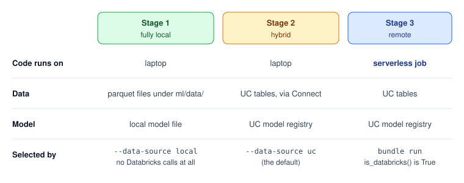
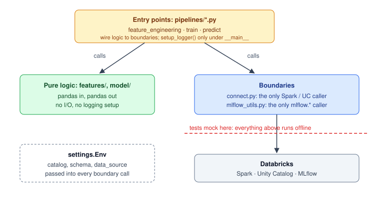
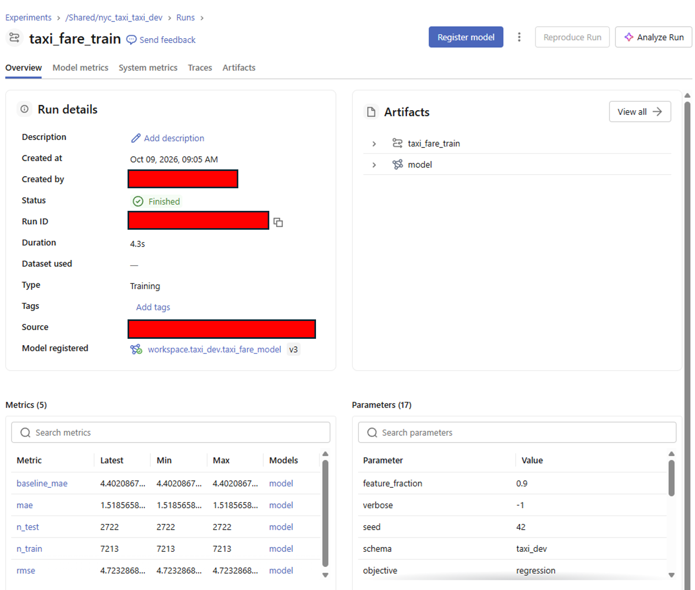
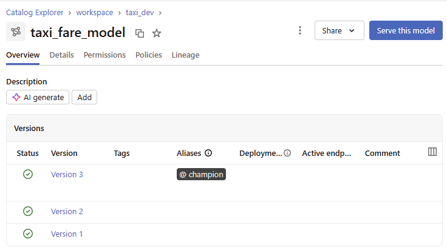
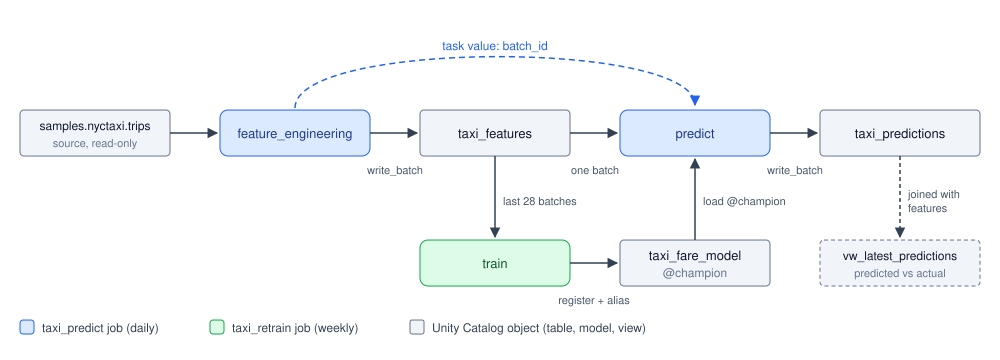
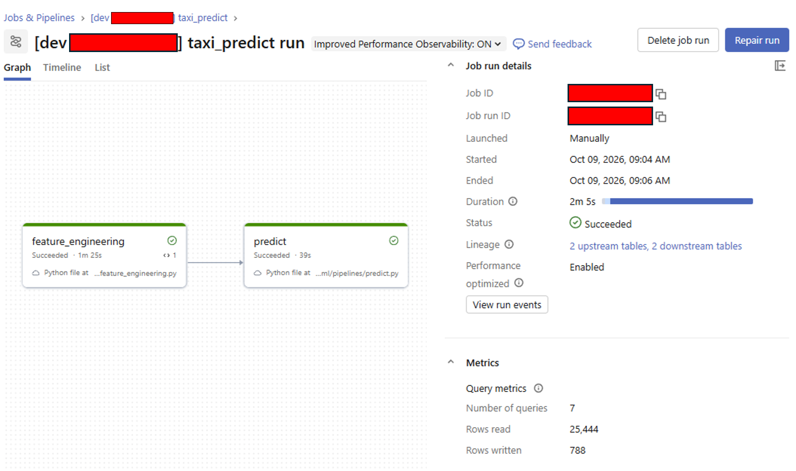
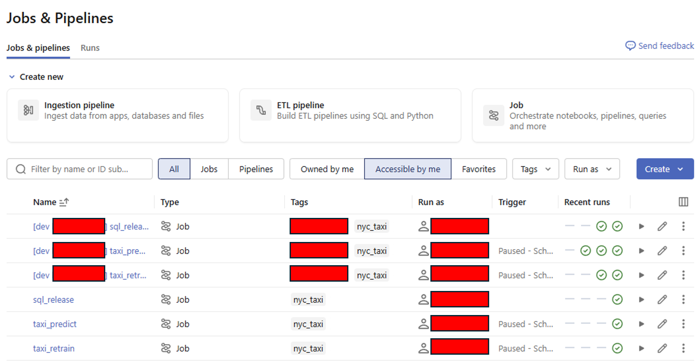
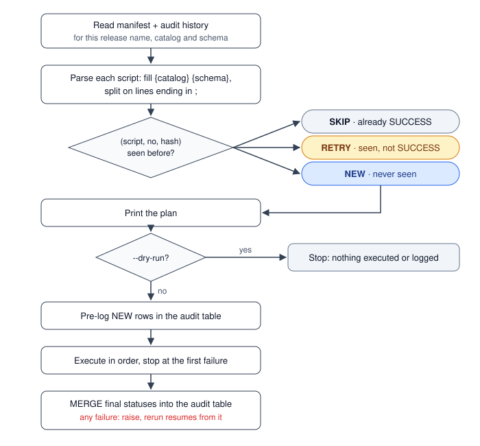

**Prerequisite**: Python and pandas, basic machine learning (train/test split, a gradient-boosted model), Git and a terminal, basic SQL DDL (`CREATE TABLE`). No prior Databricks experience needed.

**Code**: <a href="https://github.com/hovinh/databricks-learning-lab">Github</a>

- [From Prototype to Live Job](#from-prototype-to-live-job)
- [Stage 1: A Plain Python Prototype](#stage-1-a-plain-python-prototype)
- [The Databricks Pieces You Need](#the-databricks-pieces-you-need)
- [Keep Databricks at the Edges](#keep-databricks-at-the-edges)
- [Tracking and Registering the Model with MLflow](#tracking-and-registering-the-model-with-mlflow)
- [Stage 2: Laptop Code, Real Data](#stage-2-laptop-code-real-data)
- [Tests That Stay Offline](#tests-that-stay-offline)
- [Stage 3: Scheduled Jobs with Asset Bundles](#stage-3-scheduled-jobs-with-asset-bundles)
- [Tables Need Their Own Release](#tables-need-their-own-release)
- [From One Workspace to Four Environments](#from-one-workspace-to-four-environments)
- [Summary](#summary)

## From Prototype to Live Job

Most models start life the same way: a few Python files on a laptop, a data extract in a folder, and a metric that looks promising. Getting from there to a model that **runs every day on its own**, reading live data and writing predictions somewhere other people can use them, is a different kind of work. The model code barely changes. What changes is where the data lives, where the code runs, and who presses the button.

This post walks through that journey on **Databricks**, with a development flow I've come to like: you never switch to a different codebase along the way. Instead, the same plain Python files move through three stages:

1. **Fully local.** Code and data on the laptop. Fast to iterate, nothing to configure.
2. **Hybrid.** Code still on the laptop, in your IDE with your debugger, but reading and writing real tables in Databricks.
3. **Remote.** The same files deployed as scheduled jobs on Databricks, with nobody at the keyboard.

{:data-width="760" data-height="300"}
Fig. 1. The three stages. Stage 1 runs entirely on the laptop with local files. Stage 2 runs the code locally against real Unity Catalog (UC) tables and the UC model registry through Databricks Connect. Stage 3 runs the same files as a serverless job. Once the code is structured for it (Stage 2), a command-line switch picks between Stage 1 and Stage 2, and a deploy gives you Stage 3.
{:.figure}

As the use case, I picked **NYC taxi fare prediction**: given a trip's pickup and dropoff zip codes, distance and time, predict its fare. The data is the `samples.nyctaxi.trips` table that ships with every Databricks workspace, so anyone can follow along on **Databricks Free Edition**. By the end there's a small but complete project: three pipelines (feature engineering, training, prediction), its own tables, a LightGBM model in a model registry, a daily prediction job, a weekly retrain job, and separate dev and prd environments.

Everything shown ran end to end on Free Edition in October 2026, and every output in the post is a real capture. The complete code is in the repository linked above, and its README lists the exact commands for each stage.

## Stage 1: A Plain Python Prototype

### Why scripts, not notebooks

Databricks notebooks are a lovely place to *explore* data: the compute is already attached, tables are one line away, and a chart is one click from a DataFrame. They're a harder place to *build* something that will run unattended. A notebook diff is mostly noise, unit-testing a notebook is awkward, and "it worked when I ran the cells in this order" isn't a deployment strategy. So I explore in notebooks, and write the pipelines as plain Python scripts from day one: they diff cleanly, they import into tests, and, as we'll see in Stage 3, a Databricks job can run a `.py` file directly. Nothing in the final project needs a notebook.

### The data and the model

Imagine the data isn't in Databricks yet, a common situation early on: someone has sent you an extract. Here, that's a parquet copy of `samples.nyctaxi.trips`: 21,932 trips over 60 days, from 2016-01-01 to 2016-02-29, each with pickup and dropoff times, zip codes, distance and fare. (One day stands out: 2016-01-23 has only 78 trips against roughly 350 on a normal day. That's the January 2016 blizzard, visible in a sample table.)

The prototype is three small scripts, and the snippets below are simplified from the real code to show only the core idea. One concept shapes all of them: the **batch**. The final system will predict one day of trips at a time, so every row carries a `batch_id` (the day as `yyyyMMdd`), and every step works batch by batch.

**Feature engineering.** For each day $$D$$, the features of a trip are its distance and zip codes, its pickup hour and weekday, and two statistics about its zip-code pair: the median fare and the trip count over the seven days *before* $$D$$. Using only earlier days matters. The features never contain the fares we're about to predict, and a batch's features come out the same no matter when you compute them.

```python
from datetime import date, timedelta

import numpy as np
import pandas as pd

LOOKBACK_DAYS = 7
PAIR = ["pickup_zip", "dropoff_zip"]
TARGET = "fare_amount"
FEATURES = [
    "trip_distance", "pickup_zip", "dropoff_zip",
    "pickup_hour_sin", "pickup_hour_cos", "pickup_dow_sin", "pickup_dow_cos",
    "is_weekend", "pair_median_fare", "pair_trip_count",
]


def build_features(trips: pd.DataFrame, batch_date: date) -> pd.DataFrame:
    """Features for the trips picked up on batch_date. The zip-pair
    statistics use only the LOOKBACK_DAYS days *before* batch_date."""
    pickup_date = trips["tpep_pickup_datetime"].dt.date
    day = trips[pickup_date == batch_date].copy()
    history = trips[
        (pickup_date < batch_date)
        & (pickup_date >= batch_date - timedelta(days=LOOKBACK_DAYS))
    ]

    pair_stats = (
        history.groupby(PAIR)["fare_amount"]
        .agg(pair_median_fare="median", pair_trip_count="count")
        .reset_index()
    )
    day = day.merge(pair_stats, on=PAIR, how="left")
    day["pair_trip_count"] = day["pair_trip_count"].fillna(0)

    hour = day["tpep_pickup_datetime"].dt.hour
    dow = day["tpep_pickup_datetime"].dt.dayofweek
    day["pickup_hour_sin"] = np.sin(2 * np.pi * hour / 24)
    day["pickup_hour_cos"] = np.cos(2 * np.pi * hour / 24)
    day["pickup_dow_sin"] = np.sin(2 * np.pi * dow / 7)
    day["pickup_dow_cos"] = np.cos(2 * np.pi * dow / 7)
    day["is_weekend"] = (dow >= 5).astype(int)

    day["batch_id"] = int(batch_date.strftime("%Y%m%d"))
    return day


if __name__ == "__main__":
    trips = pd.read_parquet("data/trips.parquet")
    days = pd.date_range("2016-01-08", "2016-02-15").date
    features = pd.concat([build_features(trips, d) for d in days])
    features.to_parquet("data/features.parquet", index=False)
```

The hour and weekday are encoded as points on a circle, $$(\sin(2\pi h/24), \cos(2\pi h/24))$$ for hour $$h$$, so 23:00 and 00:00 end up next to each other instead of 23 units apart. The first day with a full week of history is 2016-01-08. Stopping at 2016-02-15 leaves two weeks of "future" for the scheduled job to discover later.

**Training.** The split is by time: the most recent seven batches are the test set. A random split would leak the future into training. The model is LightGBM, and it's compared against a naive **baseline**, "the median fare for this zip pair over the last week", which is already one of the features:

```python
import lightgbm as lgb
import numpy as np
import pandas as pd

from features import FEATURES, TARGET

PARAMS = {"objective": "regression", "metric": "mae", "learning_rate": 0.05, "verbose": -1}


def time_split(df: pd.DataFrame, test_batches: int = 7):
    """The most recent batches are the test set: never a random split
    for time-ordered data."""
    batches = sorted(df["batch_id"].unique())
    is_test = df["batch_id"].isin(batches[-test_batches:])
    return df[~is_test], df[is_test]


if __name__ == "__main__":
    df = pd.read_parquet("data/features.parquet")
    df = df[df[TARGET] > 0]
    train, test = time_split(df)

    booster = lgb.train(
        PARAMS,
        lgb.Dataset(train[FEATURES], label=train[TARGET]),
        num_boost_round=1000,
        valid_sets=[lgb.Dataset(test[FEATURES], label=test[TARGET])],
        callbacks=[lgb.early_stopping(50, verbose=False)],
    )

    mae = np.mean(np.abs(booster.predict(test[FEATURES]) - test[TARGET]))
    baseline = test["pair_median_fare"].fillna(train[TARGET].median())
    baseline_mae = np.mean(np.abs(baseline - test[TARGET]))
    print(f"MAE {mae:.3f} vs baseline {baseline_mae:.3f}")
    booster.save_model("data/model.txt")
```

**Prediction.** Load the saved model, score the latest batch, write the result:

```python
import lightgbm as lgb
import pandas as pd

from features import FEATURES

if __name__ == "__main__":
    features = pd.read_parquet("data/features.parquet")
    batch = features[features["batch_id"] == features["batch_id"].max()]

    booster = lgb.Booster(model_file="data/model.txt")
    out = batch[["batch_id", "tpep_pickup_datetime", "pickup_zip", "dropoff_zip"]].copy()
    out["predicted_fare"] = booster.predict(batch[FEATURES])
    out.to_parquet("data/predictions.parquet", index=False)
```

Running the three in order:

```text
14197 rows, 39 batches
MAE 1.473 vs baseline 4.509
```

A mean absolute error of about 1.47 dollars, three times better than the baseline. The prototype works. The rest of this post is about everything around it: making the same code read real tables, track its model, run on a schedule, and survive being rerun.

## The Databricks Pieces You Need

Before moving to Stage 2, it helps to know what each Databricks piece does, because the next two stages use most of them. Here is the minimum, in the order you'll meet them.

**Workspace.** Your Databricks environment: a web UI plus the APIs behind it, where your data, jobs, files and models live. **Free Edition** gives you one workspace with serverless compute only, a default catalog called `workspace` and a read-only `samples` catalog. It has a daily compute quota and a few other limits<sup><a href="https://docs.databricks.com/aws/en/getting-started/free-edition-limitations">(1)</a></sup>, none of which a project this size runs into.

**Unity Catalog (UC).** The layer that organises and governs data. Every table has a three-level name, `catalog.schema.table`, so this project's features live in `workspace.taxi_dev.taxi_features`. Registered models live in the same namespace (`workspace.taxi_dev.taxi_fare_model`), and access is granted on these objects (`USE SCHEMA`, `SELECT`, `CREATE TABLE`, and so on). One schema per environment is how this project gets a dev and a prd on a single workspace: `taxi_dev` and `taxi_prd`.

**Serverless compute and jobs.** On serverless you never create or size a cluster: Databricks provides the compute when work arrives. A **job** is a scheduled or triggered workflow of one or more **tasks**. Each task here runs a Python file in a **serverless environment**, which is a Python version plus the libraries you list.

**Databricks CLI.** The `databricks` command-line tool. This project uses it for two things: logging in (`databricks auth login`, which stores a named **profile** in `~/.databrickscfg`) and deploying bundles (below). Databricks Connect and MLflow reuse the CLI's login, so you log in once for all three.

**Databricks Connect.** A Python library that lets code on your laptop use remote Databricks compute. You write ordinary PySpark (`spark.table(...)`, `.filter(...)`), and Connect sends the query *plan* to serverless compute, where it runs next to the data. `.toPandas()` brings the result back, and everything after that point, pandas and LightGBM included, runs on your laptop. So filter and aggregate in Spark before calling `.toPandas()`, and don't pull whole large tables down. This is what makes Stage 2 possible.

**MLflow.** Experiment tracking (parameters, metrics and artifacts for every training run) plus a **model registry**. On Databricks, registered models live in Unity Catalog. It gets its own section below.

**Databricks Asset Bundles (DABs).** Jobs as code: YAML files in the repo that describe the jobs and which files they run, deployed with `databricks bundle deploy`. This is Stage 3, where they get a full section.

**Service principal.** A non-human identity in the workspace, with its own permissions. Production jobs usually run *as* a service principal rather than as the developer who deployed them, so they don't depend on one person's account or grants. It comes back in the last section.

{:data-width="760" data-height="360"}
Fig. 2. How the pieces connect. From the laptop, Databricks Connect sends Spark work to serverless compute, MLflow talks to the tracking server and the UC model registry over REST, and `bundle deploy` uploads the same code as workspace files plus job definitions. The jobs then run on the same serverless compute.
{:.figure}

### Our working config

Databricks Connect sends code and data between your laptop and the remote runtime, so **your local Python minor version must match the runtime's**. This is the combination the project was built and tested with:

| Thing | Version |
|---|---|
| Databricks CLI | v1.20.0 |
| Local Python | 3.12 |
| `databricks-connect` | 17.3.12 (targets Databricks Runtime 17.3, Python 3.12) |
| Serverless `environment_version` for jobs | `"4"` (Python 3.12.3, pairs with Connect 17.3) |
| pandas / numpy / lightgbm / mlflow | 2.3.3 / 2.5.1 / 4.7.0 / 3.15.1 |

Install the CLI (`winget install Databricks.DatabricksCLI`, `brew install databricks/tap/databricks`, or a release binary) and log in. This is OAuth, browser-based and short-lived, so no token sits in a file:

```bash
databricks auth login --host https://<workspace-host> --profile DEFAULT
databricks current-user me --profile DEFAULT     # check
```

Code only ever refers to the profile's *name* (`DEFAULT`), never to a host or a token.

Dependencies are managed with **pip-tools**. `requirements.in` lists the direct dependencies, each pinned with `==`. `requirements.txt` is the full lock that `pip-compile` generates from it. `pip-sync` makes the venv match the lock exactly:

```bash
# Windows cmd. macOS/Linux: python3.12 -m venv ~/.venvs/taxi && source ~/.venvs/taxi/bin/activate
py -3.12 -m venv %USERPROFILE%\.venvs\taxi
%USERPROFILE%\.venvs\taxi\Scripts\activate
python -m pip install --upgrade pip pip-tools
python -m piptools compile requirements.in -o requirements.txt
python -m piptools sync requirements.txt
```

Don't install `pyspark` next to `databricks-connect`: Connect ships its own. Then a tiny smoke test proves the connection before anything else:

```python
from databricks.connect import DatabricksSession

spark = DatabricksSession.builder.serverless().profile("DEFAULT").getOrCreate()
spark.range(3).show()
print(spark.table("samples.nyctaxi.trips").limit(5).toPandas())
```

On serverless there's no cluster ID to manage: that one builder line is the whole connection.

## Keep Databricks at the Edges

We could go hybrid the obvious way: replace every `pd.read_parquet(...)` in the prototype with a `spark.table(...).toPandas()` and every `to_parquet` with a table write. It would work, and every script would become "Databricks code". You couldn't test it without a connection, couldn't run it on local files any more, and a change to how data is read would touch every file. So before going hybrid, the prototype gets one structural change:

> Only two files may talk to Databricks. Everything else is plain Python that takes and returns pandas DataFrames.

- **Boundary modules.** `connect.py` is the *only* file that talks to Spark or UC. `mlflow_utils.py` is the *only* file that calls `mlflow.*`.
- **Pure logic.** `features/` and `model/` hold the prototype's logic (`build_features`, `time_split`, training, evaluation). They take and return pandas DataFrames, with no I/O.
- **Entry points.** `pipelines/feature_engineering.py`, `train.py` and `predict.py` wire the logic to the boundaries. They're what the jobs will run.
- **An explicit environment object.** Every boundary call receives an `Env` that says where to read and write.

{:data-width="760" data-height="400"}
Fig. 3. The layering rule. Pipelines call the pure logic and the two boundary modules, and only the boundaries reach Databricks. Tests replace the boundaries with mocks (red line), so everything above it runs offline. `settings.Env` travels with every boundary call.
{:.figure}

```text
databricks-learning-lab/
├── databricks.yml        # bundle: variables, targets (Stage 3)
├── resources/            # one YAML per job
├── sql/                  # DDL + the SQL release runner
└── ml/
    ├── connect.py        # boundary: Spark / UC (or local parquet)
    ├── mlflow_utils.py   # boundary: MLflow tracking + UC registry
    ├── features/         # pure logic
    ├── model/            # pure logic
    ├── pipelines/        # entry points: feature_engineering, train, predict
    ├── settings.py       # names, feature list, Env, CLI arguments
    ├── runtime.py        # is_databricks()
    └── tests/
```

### Why `Env` matters once you go hybrid

In the prototype, "where is the data" was a hard-coded path. Once there are real tables, the same code has to target different places: your dev schema from the laptop, the prd schema from a scheduled job, local files when you're offline, and a fake catalog in tests. If the catalog and schema were module-level constants, every one of those would need an edit, an environment hack or a monkeypatch, and one forgotten constant is a dev run writing to prd.

So the target is an object, built once at the entry point and passed explicitly into every boundary call:

```python
@dataclass(frozen=True)
class Env:
    """Where a run reads and writes. Passed explicitly to every connect.* and
    mlflow_utils.* call instead of living in import-time globals."""

    catalog: str
    schema: str
    data_source: str = "uc"  # "uc" or "local"

    def table(self, name: str) -> str:
        return f"{self.catalog}.{self.schema}.{name}"

    @property
    def model_name(self) -> str:
        return self.table("taxi_fare_model")

    @property
    def experiment_path(self) -> str:
        # One experiment per environment so dev and prd runs never mix.
        return f"/Shared/nyc_taxi_{self.schema}"
```

Every pipeline builds it from the same command-line arguments, `--catalog`, `--schema` and `--data-source`, with dev defaults. A job passes `--schema taxi_prd`. A test builds `Env("test_cat", "test_sch")` in one line. Table names, the model name and the MLflow experiment all derive from it, so there is exactly one place where "which environment" is decided.

### Two switches

Running the same code in three stages comes down to two independent questions.

**Where does the code run?** Databricks sets `DATABRICKS_RUNTIME_VERSION` inside every runtime, and it's unset on a laptop:

```python
def is_databricks() -> bool:
    """True inside any Databricks runtime (job task, notebook), False locally."""
    return "DATABRICKS_RUNTIME_VERSION" in os.environ
```

The clearest use is the Spark session. In a job, Spark is already there. On the laptop, Databricks Connect builds a session to serverless compute. Either way, it's created on first use, never at import time, so tests can import the module offline:

```python
_spark = None


def get_spark():
    global _spark
    if _spark is None:
        if runtime.is_databricks():
            from pyspark.sql import SparkSession

            _spark = SparkSession.builder.getOrCreate()
        else:
            from databricks.connect import DatabricksSession

            _spark = (
                DatabricksSession.builder.serverless()
                .profile(settings.DATABRICKS_PROFILE)
                .getOrCreate()
            )
        # Same time zone locally and in jobs, so dates don't shift.
        _spark.conf.set("spark.sql.session.timeZone", "UTC")
    return _spark
```

**Where do the data and the model live?** That's `env.data_source`. With `local`, every `connect.read_*` reads parquet files under `ml/data/`, writes go to parquet there, and the model is a local file: that's the prototype, now Stage 1. With `uc`, the same functions read and write real tables and the model goes to the UC registry: Stage 2. Only `connect.py` and the model-loading branch of the pipelines know about this switch. The feature and model code never notice.

## Tracking and Registering the Model with MLflow

The prototype saved `model.txt` and printed a metric. That's fine for one person and one model. For a model that gets retrained on a schedule, you want every training run recorded (parameters, metrics, which data it saw) and a registry that says which version is live. That's **MLflow**, and it's the second boundary module.

### Pointing MLflow at the workspace

MLflow needs to know where its tracking server and registry are, and the answer depends on where the code runs. Inside a job, the bare `databricks` URIs use the job's own identity. On a laptop, there's no such context, so the URI names the CLI profile:

```python
def configure_mlflow(env) -> None:
    if runtime.is_databricks():
        mlflow.set_tracking_uri("databricks")
        mlflow.set_registry_uri("databricks-uc")
    else:
        profile = settings.DATABRICKS_PROFILE
        mlflow.set_tracking_uri(f"databricks://{profile}")
        mlflow.set_registry_uri(f"databricks-uc://{profile}")
    mlflow.set_experiment(env.experiment_path)
```

Every function in `mlflow_utils` calls this first. That matters because MLflow 3's default tracking store is a local SQLite file: any MLflow call made before the URI is set quietly logs to `./mlflow.db`, and your runs never show up in the workspace.

### Logging, registering, promoting

After training, the pipeline hands the model and its numbers to one function. It logs a run, registers the model as a new version in Unity Catalog, and points the **`champion` alias** at it:

```python
def log_and_register(env, booster, X_test, params, metrics, provenance) -> str:
    configure_mlflow(env)
    with mlflow.start_run(run_name="taxi_fare_train"):
        mlflow.log_params(params)
        mlflow.log_params({f"data_{k}": v for k, v in provenance.items()})
        mlflow.log_metrics(metrics)

        signature = infer_signature(X_test, booster.predict(X_test))
        model_info = mlflow.lightgbm.log_model(
            booster,
            name="model",
            signature=signature,
            input_example=X_test.head(5),
            pip_requirements=[
                f"lightgbm=={lgb.__version__}",
                f"pandas=={pd.__version__}",
            ],
        )

    version = mlflow.register_model(model_info.model_uri, env.model_name).version
    MlflowClient().set_registered_model_alias(env.model_name, "champion", version)
    return str(version)
```

Three details are worth copying.

**Provenance.** The `data_*` parameters record the features table, the batch range and the table's **Delta version** at training time. The data isn't packaged with the model, but `SELECT * FROM t VERSION AS OF <n>` replays exactly what it saw.

**The signature.** Unity Catalog requires one: the schema of the model's inputs and outputs, inferred from a sample. It has two side effects. At prediction time, MLflow keeps only the columns the signature declares, so ID columns you hoped to pass through vanish (the predict pipeline reattaches them). And types are inferred from the sample, so an integer column with no nulls *in the sample* becomes a non-nullable integer, and the first real null fails in production. The project sidesteps both by casting every feature to float64 with one function, used in training, in the signature and at prediction:

```python
def prepare_X(df: pd.DataFrame) -> pd.DataFrame:
    """Features only, all float64: the same frame for training, the MLflow
    signature, and prediction."""
    return df[settings.FEATURES].astype("float64")
```

**`pip_requirements`.** Without it, MLflow records the training environment's full `pip freeze`. Listing only what inference needs, at the versions actually installed, keeps the model loadable in the slimmer prediction job.

Loading the champion resolves the alias to a concrete version *first*, so the version written next to each prediction is the one actually used, and a missing champion becomes an instruction instead of an opaque error:

```python
def load_champion(env):
    configure_mlflow(env)
    try:
        version = (
            MlflowClient().get_model_version_by_alias(env.model_name, "champion").version
        )
    except MlflowException as exc:
        raise RuntimeError(
            f"No @champion version of {env.model_name}. Run the "
            "retrain job (or `python -m pipelines.train`) first."
        ) from exc
    model = mlflow.pyfunc.load_model(f"models:/{env.model_name}/{version}")
    return model, str(version)
```

<!-- TODO(screenshot): fig04-mlflow-run.png, see screenshots.md -->
{:data-width="1440" data-height="900"}
Fig. 4. A training run in the MLflow experiment. The parameters include the data provenance (`data_table`, `data_start_batch_id`, `data_end_batch_id`, `data_table_version`), and the metrics put the model's `mae` next to the zip-pair `baseline_mae`.
{:.figure}

<!-- TODO(screenshot): fig05-model-version-champion.png, see screenshots.md -->
{:data-width="1440" data-height="900"}
Fig. 5. The registered model in Unity Catalog. Each retrain adds a version, and the `champion` alias points at the one the predict pipeline loads.
{:.figure}

Every retrain is promoted unconditionally here. The natural next step is champion/challenger: move the alias only if the new version beats the current champion on the same test window.

## Stage 2: Laptop Code, Real Data

With the boundaries and `Env` in place, here is the predict pipeline, the prototype's last script grown up. It reads features through `connect`, scores them with the champion through `mlflow_utils`, and writes through `connect` again, without a single Spark or MLflow call of its own:

```python
# Reattached after predicting: the MLflow signature drops undeclared columns.
ID_COLUMNS = ["trip_id", "batch_id", "pickup_ts"]


def predict(env, batch_id: Optional[int] = None) -> int:
    """Scores one feature batch (default: the latest) and writes predictions."""
    if batch_id is None:
        batch_id = connect.read_latest_batch_id(env, settings.FEATURES_TABLE)
    if batch_id is None:
        raise ValueError(f"{settings.FEATURES_TABLE} is empty: nothing to score.")

    df, _ = connect.read_features(env, batch_id, batch_id)
    if df.empty:
        raise ValueError(f"No feature rows for batch_id={batch_id}.")

    X = prepare_X(df)
    if env.data_source == "local":
        predictions = load_booster(settings.LOCAL_MODEL_PATH).predict(X)
        version = "local"
    else:
        model, version = mlflow_utils.load_champion(env)
        predictions = model.predict(X)

    out = df[ID_COLUMNS].copy()
    out["predicted_fare"] = np.asarray(predictions, dtype="float64")
    out["model_version"] = version
    out["created_at"] = utc_now()
    connect.write_batch(
        env, out[settings.PREDICTION_TABLE_COLUMNS], settings.PREDICTIONS_TABLE
    )
    return len(out)


if __name__ == "__main__":
    parser = settings.base_arg_parser()  # --catalog, --schema, --data-source
    parser.add_argument("--batch-id", type=settings.optional_int)
    args, _ = parser.parse_known_args()

    setup_logger(process_name="predict")
    predict(settings.env_from_args(args), args.batch_id)
```

The `batch_id` argument matters in Stage 3, where the job hands over the exact batch it just built. And note that the `__main__` block is the only place that sets up logging, so a notebook or a test can import `predict` without side effects.

### Running it both ways

The project uses **invoke**, a small task runner, for the commands you type daily (they're defined in `tasks.py`). From `ml/`:

```bash
# Stage 1: local files only. One-off: copy the source table to parquet (the "extract").
python -m scripts.export_source
invoke backfill --start 2016-01-08 --end 2016-02-15 --data-source local
invoke run-local --data-source local          # feature_engineering -> train -> predict

# Stage 2: the same, against Unity Catalog
invoke sql-release --release releases/20261006_sql_release_init.yaml   # create the tables once
invoke backfill --start 2016-01-08 --end 2016-02-15
invoke run-local
```

Stage 2 needs the project's tables to exist first. The `sql-release` line creates them, and it gets its own section below, because tables can't be deployed the way code is.

The two stages give **identical results**. The training step's log, both ways (the real pipeline trains on a rolling 28-day window, hence slightly different numbers from the prototype):

```text
# Stage 2: invoke run-local  (data: UC via Connect, model: UC registry)
[INFO 2026-10-08 20:56:26 log:42] Logging initialised for train
[INFO 2026-10-08 20:56:37 connect:72] Snapshot of read_features written to ...\ml\data\01_raw
[INFO 2026-10-08 20:56:38 train:56] Metrics: {'mae': 1.5793594128390827, 'rmse': 4.819345128558056, 'baseline_mae': 4.452145178764897, 'n_train': 7174.0, 'n_test': 2769.0}
[INFO 2026-10-08 20:59:25 mlflow_utils:67] Registered workspace.taxi_dev.taxi_fare_model v1 as @champion

# Stage 1: invoke run-local --data-source local  (data + model: local files)
[INFO 2026-10-08 21:02:00 log:42] Logging initialised for train
[INFO 2026-10-08 21:02:00 train:56] Metrics: {'mae': 1.5793594128390827, 'rmse': 4.819345128558058, 'baseline_mae': 4.452145178764897, 'n_train': 7174.0, 'n_test': 2769.0}
[INFO 2026-10-08 21:02:00 train:60] Saved local model to ...\ml\data\03_model\model.txt
```

The metrics match (`rmse` differs in the fifteenth digit, which is float noise). The cost of Stage 2 is time: reading from UC took about 11 seconds against an instant local read, and registering the model from the laptop took about three minutes, mostly artifact upload. The same registration inside a job takes about 12 seconds.

Why keep both stages? Stage 1 gives breakpoints, instant reruns and **reproducible experiments on a frozen snapshot**, and it works before the data even reaches Databricks. Stage 2 proves the code against the real tables, the real registry and data too big for the laptop. And if governance says the data must not leave the platform, Stage 1 simply isn't an option, and the switch stays on `uc`.

### Helpers that keep it boring

A few helpers in `connect.py` earn their place:

| Helper | What it solves |
|---|---|
| `write_batch(env, df, table)` | the only way any pipeline writes: replaces exactly one batch, aligned to the table's own schema |
| `to_pandas(spark_df)` | `toPandas()` plus clean-up: UC `DECIMAL` columns arrive as Python `Decimal` objects (LightGBM rejects them), and Connect puts query metrics in `df.attrs` (which `to_parquet` can't save) |
| `@export_snapshot` | in Stage 2, every read also saves its result to `ml/data/01_raw/` as CSV and parquet: a frozen copy of what the pipeline saw, to open in Excel or replay in Stage 1 |
| failing loudly | empty input, missing columns, no champion: `raise` with a hint about what to do |

`write_batch` is the one I'd copy first. A scheduled job *will* be rerun, by a retry, a colleague or you after a fix, and a plain append would duplicate that day's rows. Instead, every row carries its `batch_id`, and the write replaces exactly that batch in one Delta commit with `replaceWhere`. Rerunning a batch is a non-event: predict for 2016-02-16 still leaves 348 rows, not 696. The write also reads the target table's schema and selects, orders and casts the DataFrame's columns to match, so no caller maintains column order by hand:

```python
def write_batch(env, df: pd.DataFrame, table_name: str, batch_col: str = "batch_id"):
    """Writes exactly one batch, idempotently: that batch's rows are replaced and
    every other batch is untouched, so reruns never duplicate rows."""
    batch_ids = df[batch_col].unique()
    if len(batch_ids) != 1:
        raise ValueError(f"write_batch expects one {batch_col}, got {list(batch_ids)}")
    batch_id = int(batch_ids[0])

    spark = get_spark()
    table = env.table(table_name)
    fields = spark.table(table).schema.fields
    missing = [f.name for f in fields if f.name not in df.columns]
    if missing:
        raise ValueError(f"DataFrame is missing columns of {table}: {missing}")

    spark_df = spark.createDataFrame(df[[f.name for f in fields]])
    spark_df = spark_df.select(
        *[F.col(f.name).cast(f.dataType).alias(f.name) for f in fields]
    )
    (
        spark_df.write.mode("overwrite")
        .option("replaceWhere", f"{batch_col} = {batch_id}")
        .saveAsTable(table)
    )
```

The [full function](https://github.com/hovinh/databricks-learning-lab/blob/main/ml/connect.py) also has a local branch that does the same replace-one-batch step on a parquet file, which is what makes Stage 1 behave like Stage 2.

**Failing loudly** is less a helper than a habit. The worst bug a scheduled pipeline can have is a function that logs "no data found" and returns: the job stays green while writing nothing. Every pipeline here raises instead, with a hint:

```python
if end_batch_id is None:
    raise ValueError(
        f"{settings.FEATURES_TABLE} is empty. Run the feature_engineering "
        "backfill first (`invoke backfill --start ... --end ...`)."
    )
```

## Tests That Stay Offline

The layering rule pays off in the tests: the suite never opens a Spark session, yet it covers the pipelines' Databricks code paths. Two ideas carry it.

**Mock at the boundary.** The pipelines only reach Databricks through `connect.*` and `mlflow_utils.*`, so those are the only things to patch. The test then checks what the pipeline *would have written*, the DataFrame passed to the mocked `write_batch`:

```python
def _run(env, features, model):
    with patch("connect.read_features", return_value=(features, {})), patch(
        "mlflow_utils.load_champion", return_value=(model, "7")
    ), patch("connect.write_batch") as write:
        predict(env, batch_id=20160110)
    return write


def test_writes_prediction_table_columns(uc_env):
    model = MagicMock()
    model.predict.return_value = np.array([1.0, 2.0, 3.0])
    write = _run(uc_env, _features(), model)
    out = write.call_args[0][1]
    assert list(out.columns) == settings.PREDICTION_TABLE_COLUMNS
    assert out["predicted_fare"].tolist() == [1.0, 2.0, 3.0]
    assert out["model_version"].unique().tolist() == ["7"]
```

**A safety net.** An autouse fixture in `conftest.py` replaces `connect.get_spark` with a function that fails the test, so an accidental Spark call fails fast with a clear message instead of hanging on the network:

```python
@pytest.fixture(autouse=True)
def no_spark(monkeypatch):
    def _fail():
        pytest.fail("Test tried to open a Spark session; mock the connect.* call")

    monkeypatch.setattr(connect, "get_spark", _fail)
```

The pure logic needs no mocks at all, and `Env(data_source="local")` pointed at a temporary folder tests `write_batch`'s idempotency for real: write a batch twice and check the row count didn't double. `invoke all` (format, lint, test) is the definition of done for every change, and it runs in seconds on a laptop or in CI.

## Stage 3: Scheduled Jobs with Asset Bundles

Stages 1 and 2 still need someone at the keyboard. Stage 3 deploys the same files as **jobs** that run on a schedule, and it does that with **Databricks Asset Bundles**<sup><a href="https://docs.databricks.com/aws/en/dev-tools/bundles/">(2)</a></sup>: the jobs are YAML files in the repo, reviewed like code and deployed with one command. (The current docs have renamed them Declarative Automation Bundles; the CLI command is still `databricks bundle`.)

{:data-width="1000" data-height="360"}
Fig. 6. The two scheduled jobs and the data they move. The daily `taxi_predict` job builds one batch of features and hands its `batch_id` to the predict task. The weekly `taxi_retrain` job trains on the last 28 batches and moves the `@champion` alias. A view joins the latest predictions to the actual fares.
{:.figure}

Predict isn't part of the retrain job: it doesn't need a fresh model, just *a* champion, and it runs on its own schedule. A third job, `sql_release`, is triggered by hand to create or change tables.

### The bundle file

The bundle's root is `databricks.yml`. The parts that matter:

```yaml
bundle:
  name: nyc_taxi

include:
  - resources/*.yml          # one file per job

variables:
  catalog:
    default: workspace
  schema:
    default: taxi_dev
  environment_version:
    default: "4"             # Python 3.12 + Databricks Connect 17.3
  ml_dependencies:
    type: complex
    default:                 # keep in sync with ml/requirements.in
      - pandas==2.3.3
      - numpy==2.5.1
      - lightgbm==4.7.0
      - mlflow==3.15.1

targets:
  dev:
    default: true
    mode: development
  prd:
    mode: production
    variables:
      schema: taxi_prd
    presets:
      trigger_pause_status: PAUSED
```

**Variables** are referenced as `${var.name}`. The libraries are written once, as a list variable, instead of being repeated in every job.

**Targets** are environments. `dev` uses **development mode**: every job name gets a `[dev <your user>]` prefix, schedules are paused, and files go under your home folder, so your experiments never clobber the real jobs. `prd` uses **production mode**: real names, real schedules, and its own schema.

The `prd` schedules here deploy paused anyway, because the source data is a fixed 60 days. Each run of the feature pipeline processes the *next unprocessed day*, so every scheduled run advances a simulated clock by one day, and active schedules would march it to the end of February and then fail every morning. A real project drops that preset.

### A serverless job

The daily predict job, minus notifications and tags:


```yaml
resources:
  jobs:
    taxi_predict:
      name: taxi_predict
      max_concurrent_runs: 1
      tasks:
        - task_key: feature_engineering
          environment_key: ml_env
          spark_python_task:
            python_file: ${workspace.file_path}/ml/pipelines/feature_engineering.py
            parameters: [--catalog, "${var.catalog}", --schema, "${var.schema}"]
        - task_key: predict
          depends_on:
            - task_key: feature_engineering
          environment_key: ml_env
          spark_python_task:
            python_file: ${workspace.file_path}/ml/pipelines/predict.py
            parameters:
              - --catalog
              - ${var.catalog}
              - --schema
              - ${var.schema}
              - --batch-id
              - "{{tasks.feature_engineering.values.batch_id}}"
      environments:
        - environment_key: ml_env
          spec:
            environment_version: ${var.environment_version}
            dependencies: ${var.ml_dependencies}
      schedule:
        quartz_cron_expression: "0 0 6 * * ?"
        timezone_id: UTC
```


Reading it:

- **No cluster spec means serverless.** The `environments` block names a serverless environment version and the libraries to install into it.
- **A `spark_python_task` runs a `.py` file**, and its `parameters` become `sys.argv`. These are the same `--catalog` and `--schema` arguments the pipelines take on the laptop, which is how `Env` reaches the job. `${workspace.file_path}` is where the bundle uploaded the repo's files.
- **`environment_version` pins the Python version.** It's the job-side half of the version match from the working config. A library that needs a newer Python than the environment provides fails to install with "Could not find a version that satisfies the requirement", even though it's on PyPI. The current pairings, from the release notes<sup><a href="https://docs.databricks.com/aws/en/release-notes/serverless/environment-version/">(3)</a></sup>:

| `environment_version` | Python | Databricks Connect |
|---|---|---|
| 1 | 3.10.12 | 14.3 |
| 2 | 3.11.10 | 15.4 |
| 3 | 3.12.3 | 16.4 |
| 4 | 3.12.3 | 17.3 |
| 5 | 3.12.3 | 18 |
| 6 | 3.12.3 | 19 |

- **Task values pass data between tasks.** The feature task publishes the batch it built with `dbutils.jobs.taskValues.set(key="batch_id", value=batch_id)` (wrapped in a helper that does nothing off Databricks), and the predict task receives it as `{{tasks.feature_engineering.values.batch_id}}`. Without it, both tasks would guess "the latest batch", and those guesses can race.
- **`max_concurrent_runs: 1`**, because two overlapping runs would both pick the same "next day".

### Validate, deploy, run

All bundle commands run from the repo root:

```bash
databricks bundle validate             # check the configuration, change nothing
databricks bundle deploy               # target dev (the default)
databricks bundle run sql_release --params release_file=releases/20261006_sql_release_init.yaml
databricks bundle run taxi_retrain
databricks bundle run taxi_predict
databricks bundle summary              # what is deployed where
databricks bundle deploy -t prd
```

- **`validate`** loads every YAML file, resolves variables and substitutions for the target, checks the result against the bundle schema, and prints where it would deploy. It changes nothing in the workspace, so it's the cheap check before every deploy (and in CI).
- **`deploy`** uploads the repo's files to the target's folder in the workspace (skipping gitignored and excluded paths), then creates, updates or deletes jobs so the workspace matches the YAML. It records what it deployed, so the next deploy only changes what differs.
- **`run <job>`** triggers a job and follows it until it finishes. `--params` sets job parameters for that one run.
- **`summary`** lists what's deployed for the target, with links.

<!-- TODO(screenshot): fig07-job-run-dag.png, see screenshots.md -->
{:data-width="1440" data-height="900"}
Fig. 7. A run of the `taxi_predict` job: the `feature_engineering` task, then `predict`, which depends on it and receives its `batch_id` as a task value.
{:.figure}

<!-- TODO(screenshot): fig08-jobs-list-dev-prefix.png, see screenshots.md -->
{:data-width="1440" data-height="900"}
Fig. 8. The jobs list after a dev deploy. Development mode prefixes every job with `[dev <user>]`, so personal deployments never collide with the real `prd` jobs.
{:.figure}

### The one thing that differs in a job

Almost everything in Stage 2 carries over unchanged, but one line doesn't. A `spark_python_task` runs your file through `exec`, so `__file__` is never defined, and the working directory isn't the repo root. The pipelines need `ml/` on `sys.path` to import `settings` and `connect`, so each one starts with a small bootstrap. Databricks' wrapper keeps the file path in a local variable called `filename`, which the executed code can see:

```python
import sys
from pathlib import Path

try:
    _entry = Path(__file__)
except NameError:  # Databricks spark_python_task
    _entry = Path(filename)  # noqa: F821
sys.path.insert(0, str(_entry.resolve().parent.parent))  # -> ml/
```

It's a hack, and a clean alternative exists: package the code as a wheel and run it with a `python_wheel_task`. For a project this size, four lines are the better trade. Two related habits: each serverless task gets fresh compute, so tasks hand data to each other through tables and task values, never local files, and logs go to stdout, where the job run captures them.

## Tables Need Their Own Release

The bundle deploys code and jobs. It does not create the project's tables, and that's deliberate.

### Why tables can't be deployed like code

A deploy **replaces code** every time, which is safe because code holds no state. **Tables hold data.** "Redeploying" a table by dropping and recreating it destroys the data. Bundles manage jobs, files and some UC objects, but **not table DDL** (`databricks bundle schema` on CLI v1.20.0 lists 38 resource types, including schemas, volumes and registered models, and no tables).

So tables need their own deployment path, and it has to be:

- **repeatable** across environments: the same scripts against a different catalog or schema
- **ordered**: schema, then tables, then the views that read them
- **auditable**: what ran, where, when, and with what result
- **safe to rerun**: resume after a failure, and never rerun a statement that already succeeded

The options, simplest first, are a DDL notebook someone runs by hand (with no record of what ran where), a **manifest plus a runner job** (this section), tables owned by a declarative pipeline, or a migration tool such as Flyway, Liquibase or Terraform.

### The pieces

```text
sql/
├── schemas/taxi.sql                         # CREATE SCHEMA IF NOT EXISTS {catalog}.{schema}
├── tables/taxi_features.sql                 # CREATE TABLE IF NOT EXISTS ...
├── tables/taxi_predictions.sql
├── views/vw_latest_predictions.sql          # CREATE OR REPLACE VIEW ...
├── releases/20261006_sql_release_init.yaml  # WHAT to run, in WHICH order
└── runner/run_sql_release.py                # HOW to run it safely
resources/job_sql_release.yml                # the runner as a job (manual trigger)
<catalog>.<schema>.log_sql_release           # audit table the runner maintains
```

The **DDL files** are plain SQL, one object per file. `{catalog}` and `{schema}` are placeholders the runner fills in per environment:

```sql
CREATE TABLE IF NOT EXISTS {catalog}.{schema}.taxi_predictions (
    trip_id           BIGINT     COMMENT 'Trip identifier, joins to taxi_features.trip_id'
    , batch_id        INT        COMMENT 'Batch the prediction was made for, as yyyyMMdd'
    , pickup_ts       TIMESTAMP  COMMENT 'Pickup timestamp (UTC)'
    , predicted_fare  DOUBLE     COMMENT 'Predicted fare in USD'
    , model_version   STRING     COMMENT 'Registered model version used, or local'
    , created_at      TIMESTAMP  COMMENT 'When the row was written (UTC)'
)
COMMENT 'Fare predictions, one row per trip per batch. Rewritten idempotently per batch_id by the predict pipeline.';
```

The same column list also lives in Python (`settings.PREDICTION_TABLE_COLUMNS`), because the pipelines build DataFrames against it. A small **contract test** parses the DDL and asserts the two lists match, in order, so they can't drift.

The **manifest** says what to run, in which order, under which release name:

```yaml
release: release_20261006_init        # the audit history is keyed on this name
scripts:                               # top to bottom = dependency order
  - schemas/taxi.sql
  - tables/taxi_features.sql
  - tables/taxi_predictions.sql
  - views/vw_latest_predictions.sql
```

The **runner** ([one Python file](https://github.com/hovinh/databricks-learning-lab/blob/main/sql/runner/run_sql_release.py), about 300 lines) runs locally through Databricks Connect (`invoke sql-release --release ...`) or as the `sql_release` job. The **audit table** `log_sql_release` has one row per statement per release: the release name, catalog and schema, the statement's identity, its `status` (`NEW`, `SUCCESS` or `FAILED`), a truncated error, and timings.

### What happens when you run a release

{:data-width="700" data-height="650"}
Fig. 9. One run of the SQL release runner. Each statement's identity is looked up in the audit history and classified as SKIP, RETRY or NEW. A dry run stops after printing the plan. A real run pre-logs new statements, executes until the first failure, writes the final statuses back, and raises if anything failed, so the next run resumes from that statement.
{:.figure}

1. **Load the history**: every audit row for this release name in this catalog and schema.
2. **Parse**: fill in the placeholders and split each script into statements. A statement ends at a line whose last character is `;`.
3. **Classify** each statement by its **identity**: the script path, its number in the script, and a hash of its whitespace-normalised SQL. Already succeeded: SKIP. Seen but not succeeded: RETRY. Never seen: NEW.
4. **Print the plan.** With `--dry-run`, stop here: nothing is executed or logged, so it's a safe preview, even against prd.
5. **Pre-log** the NEW statements before executing anything, so the audit table shows the whole plan even if the process dies.
6. **Execute** in order, **failing fast**: the first error stops the run.
7. **Write back** the statuses with one `MERGE`. If anything failed, raise, so the job goes red.

Steps 2 and 3 are where the idea lives, and they're small, pure functions:

```python
def split_statements(sql_text: str) -> list:
    """Splits on lines that END with ';'."""
    statements, buffer = [], []
    for line in sql_text.splitlines():
        buffer.append(line)
        if line.rstrip().endswith(";"):
            statement = "\n".join(buffer).strip().rstrip(";").strip()
            if has_code(statement):  # skips comment-only chunks
                statements.append(statement)
            buffer = []
    tail = "\n".join(buffer).strip()
    if has_code(tail):
        statements.append(tail)
    return statements


def hash_statement(statement: str) -> str:
    normalised = " ".join(statement.split())
    return hashlib.sha256(normalised.encode("utf-8")).hexdigest()[:16]


# in plan_release, for each statement of each script:
prior = history.get((script_path, statement_no, hash_statement(statement)))
if prior == "SUCCESS":
    action = "SKIP"
else:
    action = "RETRY" if prior else "NEW"
```

Because the hash is over whitespace-normalised SQL, re-indenting a statement doesn't change its identity, but changing a single word does. That gives these behaviours:

| Scenario | What happens |
|---|---|
| First run, all good | all NEW, executed, SUCCESS |
| Statement 3 of 5 fails | 1–2 SUCCESS, 3 FAILED, 4–5 not reached, and the job fails |
| Fix the *cause* (a permission, the order in the manifest) and rerun the **same** release | 1–2 SKIP, 3–5 RETRY: it resumes where it stopped |
| Fix the *SQL* of statement 3 and rerun | its hash changed, so it's a new identity and it runs |
| Rerun a fully successful release | all SKIP: "Nothing to do" |
| Deliberately rerun statements that already succeeded | a new manifest with a new `release:` name: a clean slate |
| Promote dev to prd | the same manifest with `--schema taxi_prd`: history is scoped by schema too, so prd runs everything fresh |

The one rule that keeps this safe: **every statement must be safe to run twice.** Skipping protects a statement only while its identity holds, and editing a file or inserting a statement above it gives it a new identity, so it runs again. That's harmless for `CREATE TABLE IF NOT EXISTS` and `CREATE OR REPLACE VIEW` (views hold no data), and a data-loss bug for `CREATE OR REPLACE TABLE`. So tables are created with `IF NOT EXISTS`, later changes come as new, additive `ALTER TABLE` statements in a new release, and `;` appears only at the end of a statement, since the splitter is line-based.

### Try it

A dry run against an empty schema, `taxi_sandbox`, from `ml/`:

```bash
invoke sql-release --release releases/20261006_sql_release_init.yaml --schema taxi_sandbox --dry-run
```

```text
Release release_20261006_init -> workspace.taxi_sandbox (4 scripts)
  [NEW  ] schemas/taxi.sql #1  workspace.taxi_sandbox
  [NEW  ] tables/taxi_features.sql #1  workspace.taxi_sandbox.taxi_features
  [NEW  ] tables/taxi_predictions.sql #1  workspace.taxi_sandbox.taxi_predictions
  [NEW  ] views/vw_latest_predictions.sql #1  workspace.taxi_sandbox.vw_latest_predictions
Plan: 4 new, 0 retry, 0 skip
Dry run: nothing executed, nothing logged.
```

Now a failure and a resume. A drill manifest lists the view *before* the tables it reads. The schema is created, the view fails because its tables don't exist yet, the tables are never reached, and the run exits non-zero:

```text
[schemas/taxi.sql #1] workspace.taxi_sandbox
    -> SUCCESS
[views/vw_latest_predictions.sql #1] workspace.taxi_sandbox.vw_latest_predictions
    -> FAILED: [TABLE_OR_VIEW_NOT_FOUND] The table or view `workspace`.`taxi_sandbox`.`taxi_predictions` cannot be found. ...
Succeeded: 1, failed: 1, not reached: 2, skipped: 0
RuntimeError: Release release_20261007_order_drill failed. Fix the cause and rerun the same release to resume from the failed statement.
```

Fix the order in the manifest (view last) and run the **same release** again. The schema is skipped. The tables come back as RETRY rather than NEW, because the failed run pre-logged them:

```text
  [SKIP ] schemas/taxi.sql #1  workspace.taxi_sandbox
  [RETRY] tables/taxi_features.sql #1  workspace.taxi_sandbox.taxi_features
  [RETRY] tables/taxi_predictions.sql #1  workspace.taxi_sandbox.taxi_predictions
  [RETRY] views/vw_latest_predictions.sql #1  workspace.taxi_sandbox.vw_latest_predictions
Plan: 0 new, 3 retry, 1 skip
...
Succeeded: 3, failed: 0, not reached: 0, skipped: 1
```

As a job, the same release is `databricks bundle run sql_release --params release_file=releases/<file>.yaml`. Local runs and job runs share the audit table, so running the init release as a job after a local run prints four SKIPs and "Nothing to do".

## From One Workspace to Four Environments

This project has two environments on one workspace, told apart by schema. An enterprise setup typically has four (dev, SIT, STG and PRD), each in its own workspace. Most of the setup carries over unchanged, and three things need decisions.

### How the code learns which environment it's in

**Option A, bundle target variables**, is what this project does: each target sets `catalog` and `schema`, and the jobs pass them to the pipelines as arguments. It's explicit and works well on one workspace.

**Option B, a workspace-resident config file.** When each environment is its own workspace, each workspace can carry a config file at a fixed path that says which environment it is. The code reads it on Databricks and a local, gitignored copy otherwise:

```python
def load_workspace_config() -> dict:
    if runtime.is_databricks():
        path = Path("/Workspace/<org>/workspace_config/config.json")  # provisioned per workspace
    else:
        path = ML_ROOT / "config.local.json"  # gitignored local copy
    return json.loads(path.read_text())


# config.json:  {"ENV": "sit", "CATALOG": "<org>_sit"}
```

The bundle target then only means "where to deploy", not "which data", and one build works in every environment. The cost is that the config is invisible from the repo. Either way, `Env` is built from that one value, and everything else (table names, the MLflow experiment, the model name) derives from it.

### Running as a service principal

```yaml
targets:
  user_dev:
    default: true
    mode: development
  sit:                                   # same shape for stg and prd
    mode: production
    workspace:
      root_path: /Workspace/<org>/.bundle/${bundle.name}
    run_as:
      service_principal_name: <sp-application-id>
    permissions:
      - group_name: <PROJECT>_SIT_DEVELOPER
        level: CAN_RUN
      - group_name: admins
        level: CAN_MANAGE
```

`run_as` makes the jobs run as a **service principal** instead of as whoever deployed them, and `permissions` let developers run the jobs while only admins manage them. That has one consequence worth remembering: **grants follow the identity.** Your local runs use your permissions; the job uses the principal's. A job can fail with `INSUFFICIENT_PERMISSIONS` on a table your laptop reads happily, and the fix is a grant to the principal, not to you. (Free Edition supports service principals and `run_as` too, though this project's jobs simply run as you.)

### Promotion

Code moves through Git: pull requests from `main` to each environment's branch, with `databricks bundle deploy -t <env>` after each merge, and the same SQL release manifest run against each environment's schema. A CI pipeline that runs `invoke all` and `databricks bundle validate` on every pull request, and deploys on merge, only needs the commands you already run by hand.

## Summary

The model code barely changed on the way from prototype to scheduled job. `build_features` and `time_split` are still the pandas functions from Stage 1. What changed is everything around them, and each stage added one layer:

- **Stage 1 → Stage 2: separate the logic from the I/O.** Spark lives in one file and MLflow in another, everything else is plain pandas, and an explicit `Env` says where every read and write goes. That one rule gives two switches (where the code runs, where the data lives), identical results with local files or real tables, and a test suite that never needs Databricks.
- **The model became an artifact with a history.** MLflow records each training run with its data provenance, Unity Catalog holds the versions, and an alias says which one is live.
- **Stage 2 → Stage 3: code is replaced, state is not.** A bundle owns the code and jobs completely, because redeploying code is safe. Tables hold data, so they get their own path: a manifest, a runner that remembers every statement, and an audit table that makes a failed release resumable. And every pipeline write replaces exactly one batch, so reruns are a non-event.
- **Jobs run as someone else.** In an enterprise setup, permissions follow the job's identity, not the developer's.

From here, the natural extensions are champion/challenger promotion, monitoring with the latest-predictions view, wheel packaging instead of the path bootstrap, and CI/CD. None of them changes the shape: plain Python in the IDE, the same files as scheduled jobs, and nothing in between that only works on one laptop.

---

(1) <a href="https://docs.databricks.com/aws/en/getting-started/free-edition-limitations">https://docs.databricks.com/aws/en/getting-started/free-edition-limitations</a>

(2) <a href="https://docs.databricks.com/aws/en/dev-tools/bundles/">https://docs.databricks.com/aws/en/dev-tools/bundles/</a>

(3) <a href="https://docs.databricks.com/aws/en/release-notes/serverless/environment-version/">https://docs.databricks.com/aws/en/release-notes/serverless/environment-version/</a>
